# PASTR — E2E New User Journey Test Report

**Date:** 2026-03-07
**URL:** https://affiliate-scorer.vercel.app
**Tester:** Automated (agent-browser + manual review)
**Viewport:** Desktop 1280x720 + Mobile 375px

---

## Summary

| Area | Result | Notes |
|------|--------|-------|
| Step 1: Onboarding & Dashboard | **PASS** | Dashboard loads with data, sidebar correct |
| Step 2: Channel Setup | **PASS** | Both AI & manual flows work, redirect OK |
| Step 3: Data Sync & Inbox | **PASS** | Sync page clear, inbox loads with scored data |
| Step 4: Settings | **PASS** | API key connected, model selection works |
| Step 5: Navigation & UI | **PARTIAL** | All links work, dark mode OK, minor mobile issues |
| Mobile Responsive | **PARTIAL** | Bottom nav good, inbox table truncated on 375px |

**Overall verdict: 85/100 — Ready for real use with minor polish needed.**

---

## Step 1: Onboarding & Dashboard

**Result: PASS**

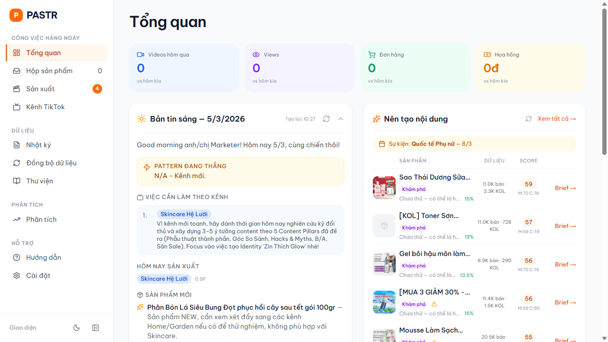

### Observations
- Dashboard loads immediately with real data (367 products, morning brief, content suggestions)
- **Sidebar groups correct:** CONG VIEC HANG NGAY (4 items), DU LIEU (3 items), PHAN TICH (1 item), HO TRO (2 items)
- Morning brief present with date, AI-generated content tasks, channel-specific advice
- Content suggestions widget shows scored products with "Brief" CTA buttons
- Stats cards (Videos, Views, Don hang, Hoa hong) all show 0 — correct for new data
- Onboarding checklist visible on mobile (2/3 complete) — good progressive disclosure

### Issues Found
- **LOW:** "Hộp sản phẩm" sidebar badge shows "0" despite 367 products in inbox — confusing label (likely counts NEW/unprocessed only, but unclear to user)

---

## Step 2: Channel Setup

**Result: PASS**

### 2a. Channel List & Form
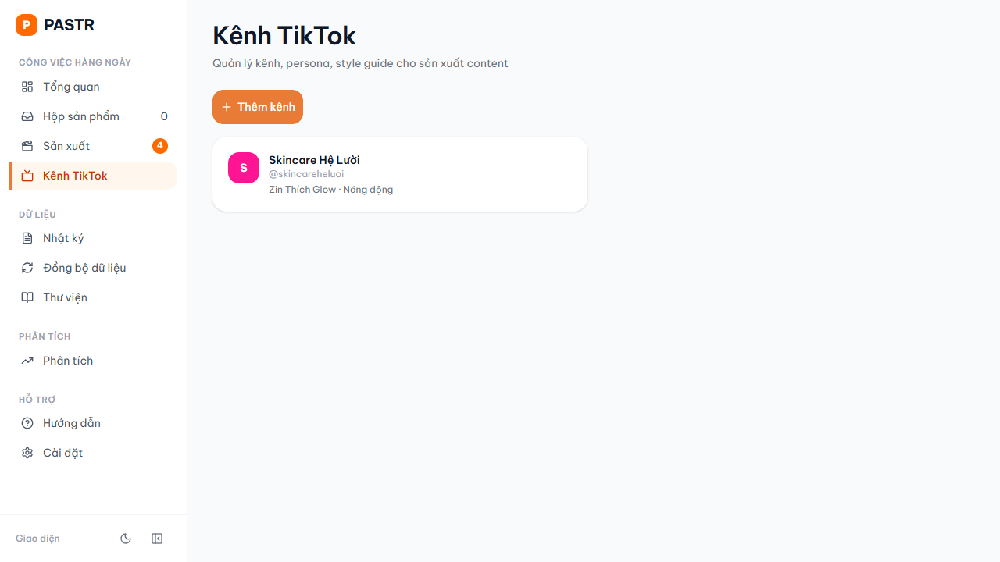
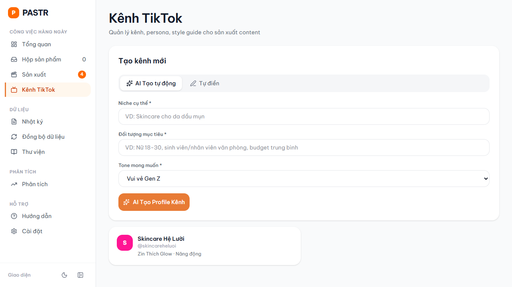
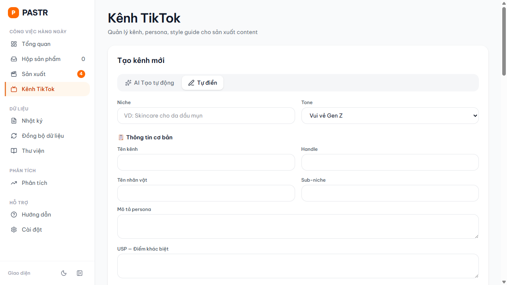

- "Thêm kênh" button visible and prominent (orange CTA)
- Two tabs: "AI Tạo tự động" and "Tự điền" — clear distinction
- AI tab has 3 fields (Niche, Target audience, Tone) + "AI Tạo Profile Kênh" button
- Manual tab has comprehensive fields: Tên kênh, Handle, Tên nhân vật, Sub-niche, Mô tả persona, USP

### 2b. Channel Save & Redirect
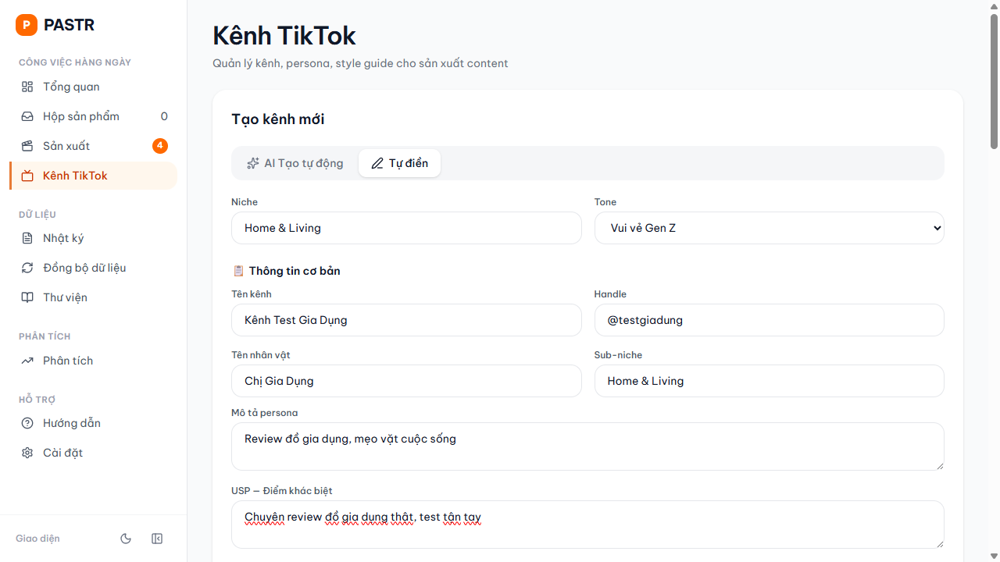
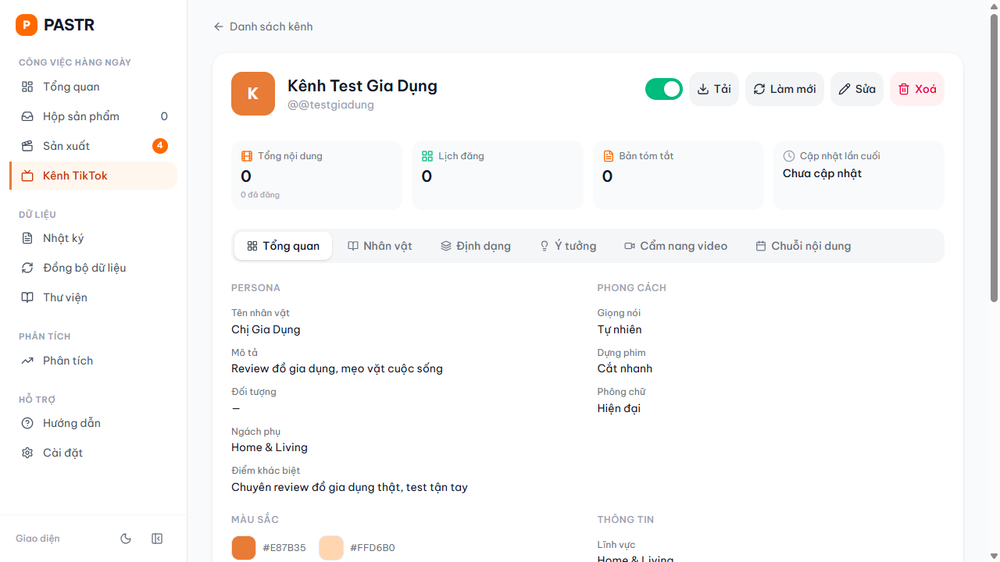

- Manual channel creation with "Home & Living" niche saved successfully
- **Redirect works:** After save, lands on `/channels/[id]` detail page
- Channel detail page shows: Persona info, Style settings (Voice/Editing/Font/Colors), Stats (0/0/0), Tabs (Tổng quan, Nhân vật, Định dạng, Ý tưởng, Cẩm nang video, Chuỗi nội dung)
- CTA Templates section and Competitor channels section visible in form

### 2c. Form Bottom Section
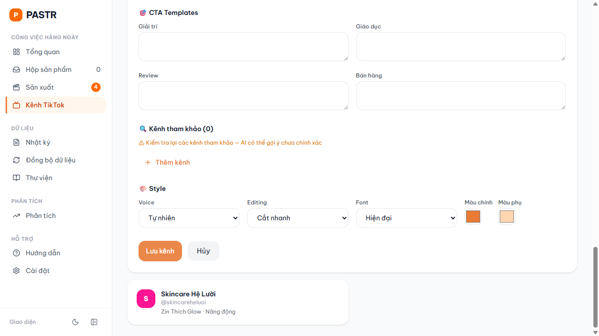

- CTA Templates: 4 categories (Giải trí, Giáo dục, Review, Bán hàng)
- Kênh tham khảo section with warning "AI có thể gợi ý chưa chính xác"
- Style section: Voice, Editing, Font dropdowns + Color pickers
- "Lưu kênh" / "Hủy" buttons clearly visible

### Issues Found
- None — flow is smooth and intuitive

---

## Step 3: Data Sync & Inbox

**Result: PASS**

### 3a. Sync Page
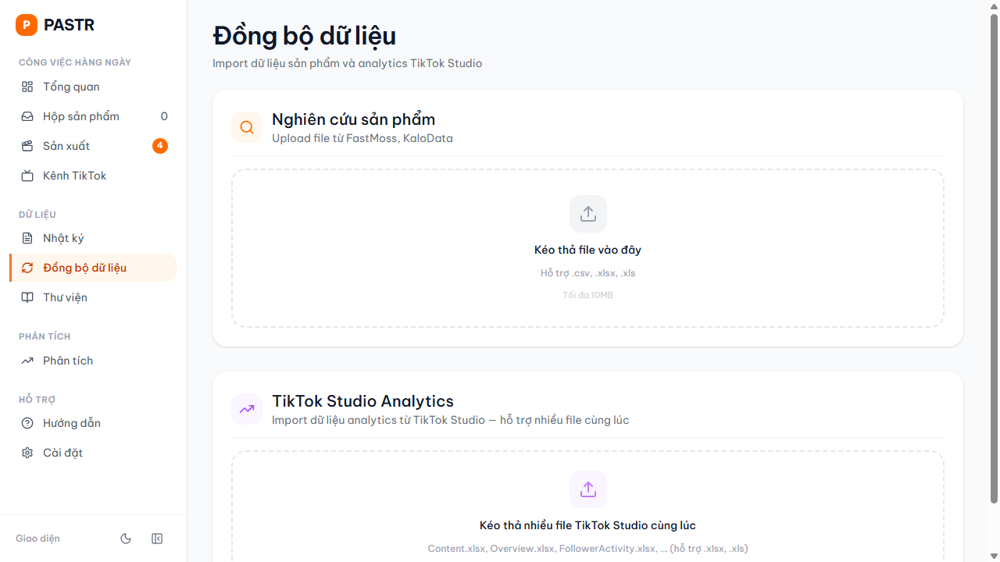

- Two upload zones: "Nghiên cứu sản phẩm" (FastMoss/KaloData) and "TikTok Studio Analytics"
- Drag-and-drop UI with file format hints (.csv, .xlsx, .xls — max 10MB)
- Clear descriptions for each upload type

### 3b. Inbox (Hộp sản phẩm)
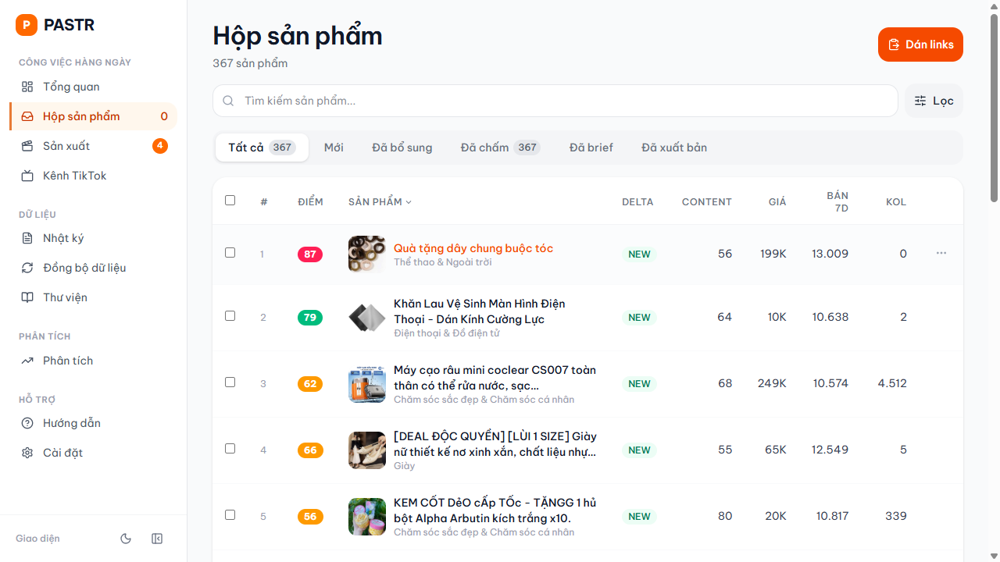

- 367 products loaded with scores (87, 79, 62, 66, 56...)
- Columns: #, DIEM, SAN PHAM, DELTA, CONTENT, GIA, BAN 7D, KOL
- Tab filters: Tất cả (367), Mới, Đã bổ sung, Đã chấm (367), Đã brief, Đã xuất bản
- Search bar + filter button present
- "Dán links" CTA prominent (red button top-right)

### 3c. Product Detail
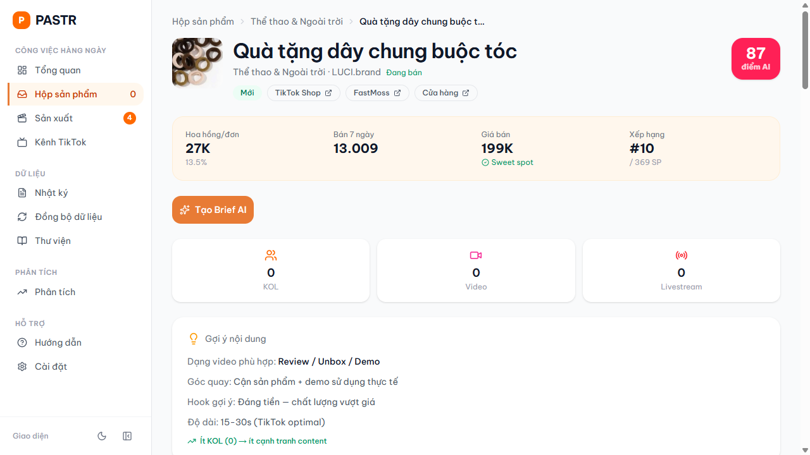

- Score badge (87 điểm AI) prominently displayed
- Product image, name, category, brand info
- External links: TikTok Shop, FastMoss, Cửa hàng
- Key metrics: Hoa hồng/đơn (27K, 13.5%), Bán 7 ngày (13,009), Giá bán (199K — Sweet spot), Xếp hạng (#10 / 369 SP)
- "Tạo Brief AI" CTA button
- Content suggestions: video format, camera angle, hook ideas, optimal length (15-30s)
- KOL/Video/Livestream stats

### 3d. Empty States
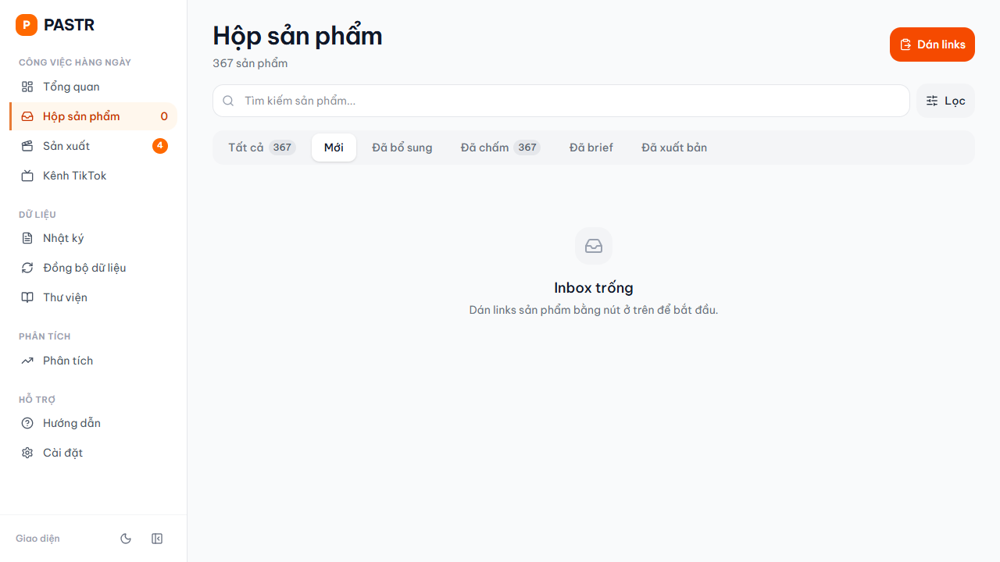

- "Mới" tab shows "Inbox trống" with helpful text "Dán links sản phẩm bằng nút ở trên để bắt đầu"
- Clean empty state design

### Issues Found
- None — data loads correctly, scoring visible, detail page comprehensive

---

## Step 4: Settings

**Result: PASS**

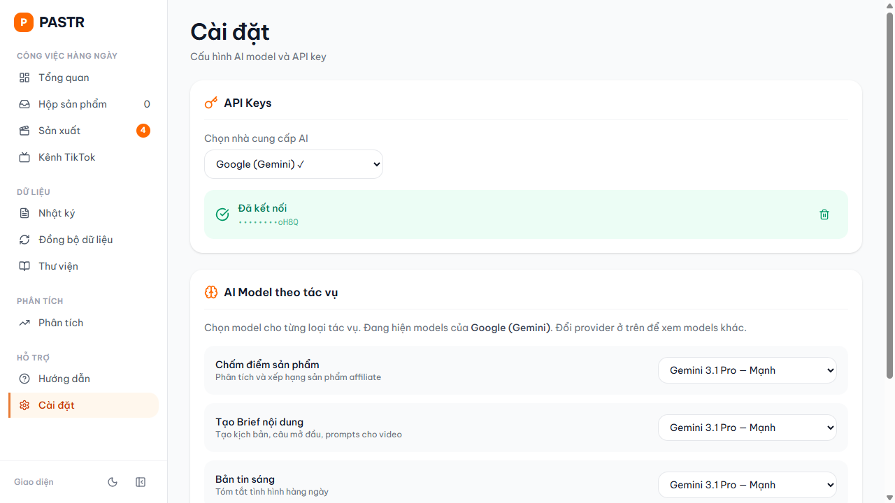

- API Keys section: Google (Gemini) selected, key connected ("Đã kết nối" green badge)
- Key partially masked (••••••••oH8Q)
- Delete key button (trash icon) available
- "AI Model theo tác vụ" section shows model selection per task:
  - Chấm điểm sản phẩm → Gemini 3.1 Pro — Mạnh
  - Tạo Brief nội dung → Gemini 3.1 Pro — Mạnh
  - Bản tin sáng → Gemini 3.1 Pro — Mạnh
- Provider-aware: "Đang hiện models của Google (Gemini). Đổi provider ở trên để xem models khác."

### Issues Found
- None — settings page clear and functional

---

## Step 5: Navigation & UI

### 5a. All Sidebar Links

| Page | Status | Screenshot |
|------|--------|------------|
| Tổng quan (Dashboard) | **PASS** | test01-dashboard.png |
| Hộp sản phẩm (Inbox) | **PASS** | test05-inbox.png |
| Sản xuất (Production) | **PASS** | test07-brief-creation.png / test08-production.png |
| Kênh TikTok (Channels) | **PASS** | test02-channels-list.png |
| Nhật ký (Log) | **PASS** | test09-log.png |
| Đồng bộ dữ liệu (Sync) | **PASS** | test03-sync-page.png |
| Thư viện (Library) | **PASS** | test10-library.png |
| Phân tích (Insights) | **PASS** | test10-insights.png |
| Hướng dẫn (Guide) | **PASS** | test10-guide.png |
| Cài đặt (Settings) | **PASS** | test11-settings.png |

All 10 sidebar links navigate correctly with no broken routes.

### 5b. Production Page
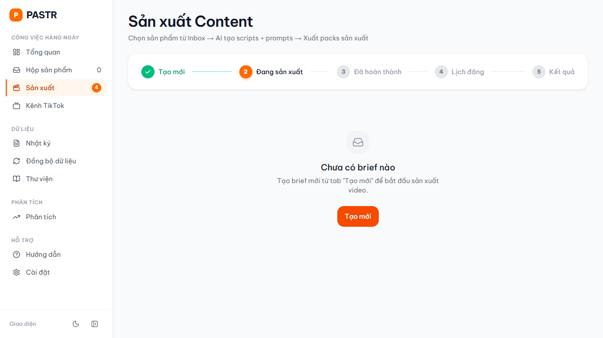

- 5-step pipeline stepper: Tạo mới → Đang sản xuất → Đã hoàn thành → Lịch đăng → Kết quả
- Empty state: "Chưa có brief nào" with "Tạo mới" CTA
- Flow description in subtitle: "Chọn sản phẩm từ Inbox → AI tạo scripts + prompts → Xuất packs sản xuất"

### 5c. Log Page
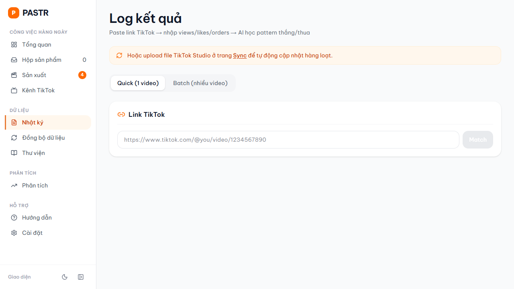

- "Log kết quả" page with link TikTok input
- Two modes: Quick (1 video) and Batch (nhiều video)
- Helper tip linking to Sync page for bulk upload
- Placeholder shows expected format

### 5d. Insights Page
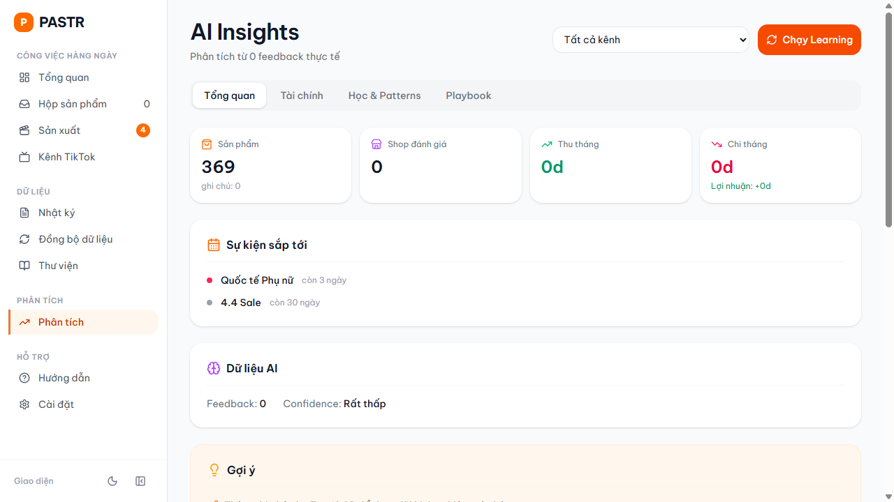

- 4 stat cards: Sản phẩm (369), Shop đánh giá (0), Thu tháng (0đ), Chi tháng (0đ)
- Tabs: Tổng quan, Tài chính, Học & Patterns, Playbook
- Upcoming events: Quốc tế Phụ nữ (còn 3 ngày), 4.4 Sale (còn 30 ngày)
- AI data section: Feedback (0), Confidence (Rất thấp)
- "Chạy Learning" CTA button

### 5e. Library Page
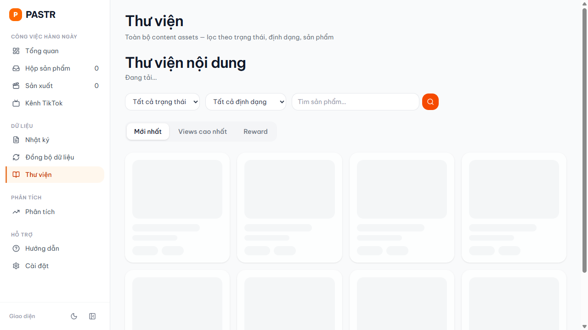

- Content asset library with filters: Trạng thái, Định dạng, search
- Tabs: Mới nhất, Views cao nhất, Reward
- Skeleton loading visible (loading state working correctly)

### 5f. Guide Page
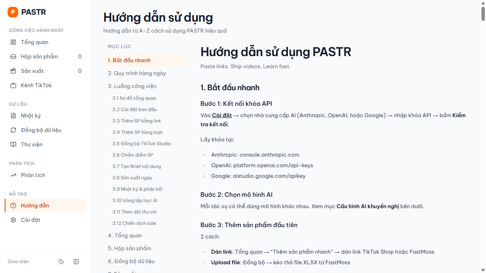

- Comprehensive "Hướng dẫn sử dụng" with TOC sidebar
- Covers: Bắt đầu nhanh, Quy trình hàng ngày, Luồng công việc
- Step-by-step instructions starting with API key setup
- Links to relevant pages (Cài đặt, etc.)

### 5g. Dark Mode
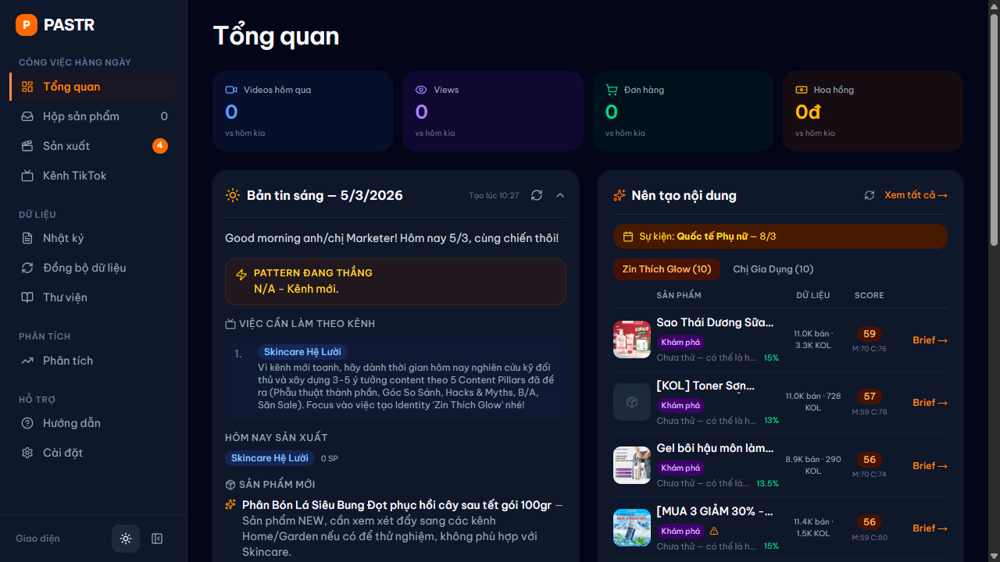

- Dark mode toggle works (moon icon in sidebar footer)
- Colors correct: dark slate background, proper contrast
- Cards, text, stats all properly themed
- Morning brief, content suggestions, sidebar all render correctly in dark mode

### Issues Found
- **LOW:** Library page shows "Đang tải..." text alongside skeleton — redundant, skeleton alone sufficient
- **LOW:** Sidebar badge "Sản xuất 4" persists even when production page shows 0 briefs — misleading count

---

## Step 6: Mobile Responsive (375px)

### 6a. Mobile Dashboard
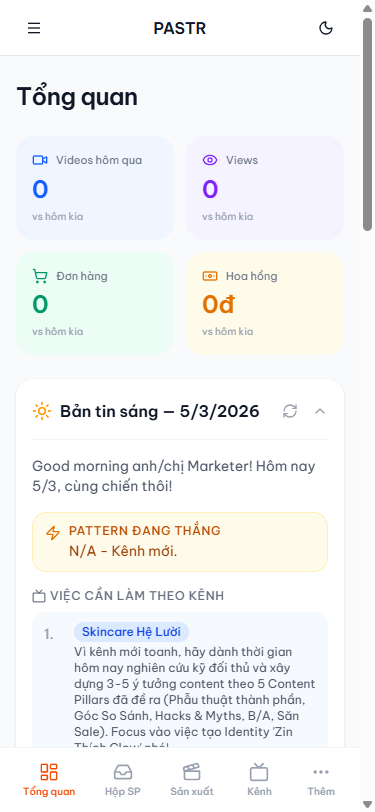
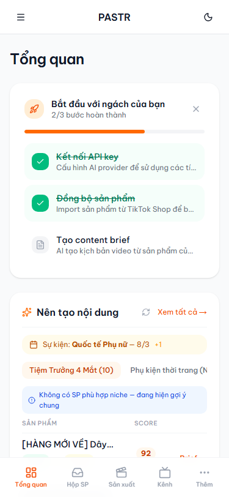
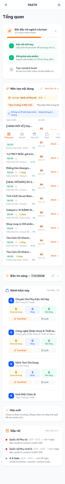

- Bottom tab bar: Tổng quan, Hộp SP, Sản xuất, Kênh, Thêm (...)
- Hamburger menu icon (top-left) for full sidebar access
- Dark mode toggle accessible (top-right)
- Stats cards stack 2x2 grid — fits well
- Morning brief readable on mobile
- Onboarding checklist with progress bar (2/3 complete) — great UX
- Content suggestions widget scrollable with product cards

### 6b. Mobile Inbox
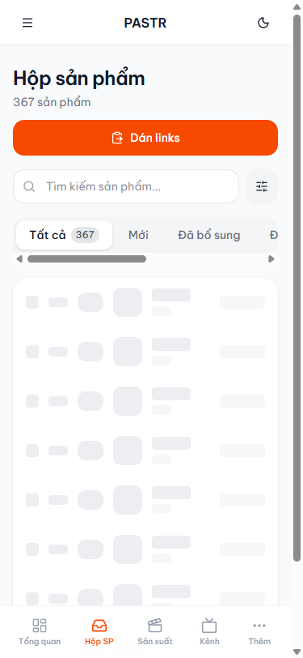
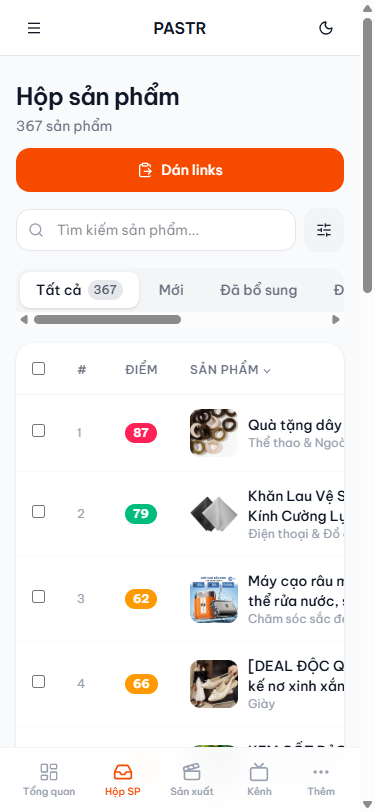

- "Dán links" CTA full-width on mobile — good touch target
- Search bar + filter icon layout works
- Tab filters horizontally scrollable
- Product list shows: checkbox, rank, score badge, thumbnail, name
- **Issue:** Product names heavily truncated ("Quà tặng dây...", "Khăn Lau Vệ S...")
- Table columns truncated — only shows #, DIEM, SAN PHAM on mobile

### Issues Found
- **HIGH:** Mobile inbox table truncates product names aggressively — consider card layout for mobile instead of table
- **MEDIUM:** "Thêm" tab in bottom nav is catch-all — 6+ pages hidden behind it. Could overwhelm new users.

---

## Overall Assessment

### Người mới có tự dùng được không?

**Có, với điều kiện đã có API key.**

**Strengths:**
1. Onboarding checklist (visible on mobile) guides user through 3 steps clearly
2. Guide page is comprehensive — covers every feature from A-Z
3. Empty states have helpful CTAs ("Tạo mới", "Dán links") — never leaves user stuck
4. Vietnamese UI throughout — no English-only dead ends
5. Sidebar grouping logical: daily tasks → data → analysis → support
6. Product scoring immediately visible after import — instant value
7. Dark mode polished and complete

**Weaknesses:**
1. No Niche Finder link in sidebar — user must know to go to it from dashboard or channels
2. Mobile inbox table needs card layout for better readability
3. Some badge counts misleading (Hộp SP shows 0, Sản xuất shows 4)
4. Library page skeleton + "Đang tải..." text redundant

### Score Breakdown

| Category | Score | Max |
|----------|-------|-----|
| Functionality (all features work) | 18 | 20 |
| Navigation (sidebar, links, redirects) | 19 | 20 |
| Empty States & Error Handling | 18 | 20 |
| Mobile Responsiveness | 14 | 20 |
| Visual Polish & Dark Mode | 16 | 20 |
| **Total** | **85** | **100** |

### Recommended Fixes Before Production Use

| Priority | Issue | Fix |
|----------|-------|-----|
| **HIGH** | Mobile inbox: product names truncated | Switch to card layout on mobile viewport |
| **MEDIUM** | Sidebar badges misleading counts | Clarify what "0" and "4" represent, or hide when 0 |
| **LOW** | Library "Đang tải..." + skeleton | Remove text, keep skeleton only |
| **LOW** | No direct Niche Finder sidebar link | Add under CONG CU group or onboarding |

---

*Report generated from 25 screenshots across desktop + mobile viewports.*
