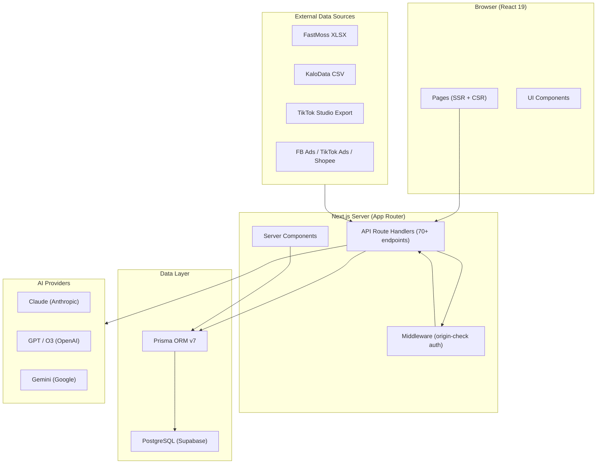

# Project Overview — PASTR

## 1. Project Overview

**Name:** PASTR (Paste links. Ship videos. Learn fast.)

**Description:** AI-powered TikTok affiliate video production tool for Vietnamese marketers. PASTR streamlines the entire affiliate content pipeline — from product discovery and scoring, through AI script/prompt generation, to performance tracking and reinforcement learning.

**Problem:** Vietnamese TikTok affiliate marketers spend 3+ hours/day on manual product research, script writing, and content planning. There is no unified tool that connects product selection → content creation → performance learning in a single feedback loop.

**Solution:** A personal-use web app that lets users paste product links, auto-score them, generate batch video scripts/prompts via AI, log results, and continuously learn what content converts best.

**Target Users:**
- Vietnamese TikTok affiliate marketers (solo operators)
- Single-user, personal tool (no multi-tenancy)
- Users who produce 5–15+ short-form videos per day
- Users leveraging AI video tools (Kling, Veo3) alongside manual production

---

## 2. Goals & Objectives

### North Star Metric
**Videos produced per day x conversion rate (videos with orders)**

### Primary Goals
1. Enable 10+ video scripts/day via AI batch generation
2. Save 3+ hours/day vs manual research + scripting
3. Build a self-improving playbook — AI learns from results over time

### KPIs
| KPI | Target | Measurement |
|-----|--------|-------------|
| Videos scripted per day | 10+ | Production batch count |
| Time saved per session | 3+ hours | Manual baseline comparison |
| Commission growth | 2-3x over 3 months | Monthly commission tracking |
| AI scoring accuracy | Improving weekly | Prediction vs actual win rate |
| Learning weight convergence | Stable after 8 weeks | Weight delta per learning cycle |

---

## 3. Core Features

### 3.1 Inbox — Link Capture & Enrichment
- **Paste Links:** Single textarea input; paste 1–20 links at once
- **Auto-detection:** Identifies link type (TikTok Shop product, TikTok video, shop page, FastMoss URL)
- **Canonical dedup:** URL normalization prevents duplicate entries
- **Pipeline states:** `New → Enriched → Scored → Briefed → Published`
- **Lazy enrichment:** Score with whatever data is available; missing fields don't block the pipeline

### 3.2 Data Import — Bulk Upload
- **FastMoss XLSX:** Upload 300+ products at once with analytics (sales 7d, revenue, KOL count, commission)
- **KaloData CSV:** Alternative data source parser
- **TikTok Ads / Shopee Ads / TikTok Affiliate / Shopee Affiliate:** CSV import parsers
- **TikTok Studio sync:** Upload Studio export files for account stats, follower activity, content insights
- **Snapshot system:** Each import creates historical snapshots for delta classification (NEW/SURGE/COOL/STABLE/REAPPEAR)
- **Background processing:** ImportBatch tracks progress with polling UI

### 3.3 AI Scoring Engine
- **Dual scoring:**
  - **Market Score** — revenue momentum, growth rate, competition density, commission rate, trend alignment, seasonality
  - **Content Potential Score** — visual wow factor, angle diversity, available creative assets, AI-production feasibility, risk flags
- **Multi-provider AI:** Claude (Anthropic), GPT/O3 (OpenAI), Gemini (Google) — user configures in Settings
- **Hybrid scoring:** 60% AI score + 40% base formula score
- **Personalization layer:** After 30+ feedbacks, applies user-specific weight adjustments
- **Batch processing:** Scores 30 products concurrently (3 parallel batches of 10)

### 3.4 Content Brief Generation
- **Per-product output:**
  - 5 content angles (different approaches)
  - 10 hooks (3-second openers)
  - 3 full scripts (Problem-Solution / Compare / Review formats)
  - Shot lists (scene-by-scene)
  - Captions + hashtags + CTAs
  - AI video prompts for Kling/Veo3
- **Batch generation:** Select multiple products → generate all briefs at once
- **Compliance check:** Validates against TikTok VN content rules

### 3.5 Production Pipeline
- **Production batches:** Group assets for daily production runs
- **Asset lifecycle:** `DRAFT → IN_PROGRESS → READY → PUBLISHED → ARCHIVED`
- **Export packs:**
  - `scripts.md` — human-readable scripts
  - `prompts.json` — paste directly into Kling/Veo3
  - `checklist.csv` — track per-video progress

### 3.6 Channel Management
- **TikTok Channel personas:** Define voice style, content mix, color palette, posting schedule per channel
- **Content calendar:** Schedule slots per channel with content type assignments
- **Tactical refresh:** AI suggests strategy adjustments based on performance data
- **Channel-scoped learning:** Weights and patterns tracked per channel

### 3.7 Character-Driven Content
- **Character Bible (7 layers):** Core beliefs, relationships, world rules, origin story, living spaces, story arcs, language & rituals
- **Visual Locks & Voice DNA:** Props, texture, color palette, tone, pace, signature
- **Format Bank (10 formats):** Review, Myth-bust, A vs B, Checklist, Story, Test, React, Mini Drama, Series Challenge, Deal Breakdown
- **Idea Matrix:** Cross bible layers × format templates → content idea suggestions with hook suggestions
- **Character-aware briefs:** AI injects character personality + format structure into brief prompts
- **Consistency QC:** 5 rule-based checks (catchphrase, hook length, proof section, CTA pattern, red lines)

### 3.8 Video Production System
- **Video Bible (12 locks):** 5 visual (framing, lighting, composition, palette, edit rhythm), 4 audio (voice style, SFX, BGM, room tone), 3 narrative (opening ritual, proof rule, closing ritual)
- **Shot Library:** 10 standardized shot codes (A1-Hook through D2-Environment) with duration hints and camera types
- **Scene Templates:** 5 default templates (PASS/FAIL Lab, Myth-bust, A vs B Compare, Mini Drama, Story) with block structure
- **Series Planner:** 4 types (evergreen, signature, arc, community) with episode goals (awareness/lead/sale)
- **AI Episode Generation:** Batch create 5 episodes from series premise + format templates
- **Enhanced Export Pack:** ZIP download with script.md, shotlist.json, caption.txt, broll-list.md, checklist.md, style-guide.md
- **Version Locking:** Lock CharacterBible and VideoBible versions; locked state prevents edits, version bumps on lock

### 3.9 Results Logging & Metrics
- **Quick log:** Paste published TikTok video URL → auto-match to asset
- **Batch log:** Log multiple video results at once
- **Metrics capture:** Views, likes, shares, saves, comments, orders
- **Reward scoring:** Maps raw metrics to a normalized reward signal for learning

### 3.10 Learning Engine (Reinforcement Learning)
- **Weekly learning cycle:** Analyzes all feedback with time-decay weighting
- **Weight adjustment:** Per-scope (hook_type, format, angle) and per-channel weights
- **Explore/exploit:** 70% proven patterns + 30% experimental content
- **Pattern detection:** Discovers winning/losing patterns automatically
- **Win/loss analysis:** Identifies what combinations drive orders vs failures
- **Playbook:** Accumulated knowledge base of winning strategies

### 3.11 AI Intelligence Layer
- **Morning Brief:** Daily AI-generated summary — what to produce today, based on scores + calendar + patterns
- **Weekly Report:** Performance summary, trends, recommendations
- **Win Probability Calculator:** Predicts success likelihood for product-channel-timing combinations
- **Anomaly Detection:** Flags unusual metric spikes/drops
- **Lifecycle Analysis:** Tracks product lifecycle stage (new → rising → hot → peak → declining → dead)
- **Confidence Widget:** Shows AI confidence level with explanation for each prediction

### 3.12 Business Layer
- **Commission tracking:** Record commission payments per product/asset
- **Financial records:** P&L tracking (commission received, ad spend, other costs)
- **Goal tracking:** Weekly/monthly targets for videos, commission, views with progress visualization
- **Calendar events:** Mega sales, flash sales, seasonal events that affect strategy

### 3.13 Settings & Configuration
- **API key management:** Encrypted storage (AES-256-GCM) for Anthropic, OpenAI, Google keys
- **Per-task AI model selection:** Choose which model handles scoring, briefs, morning brief, weekly report
- **Graceful degradation:** Missing API keys show setup banner, never crash

---

## 4. Tech Stack

| Component | Technology | Version | Notes |
|-----------|-----------|---------|-------|
| Framework | Next.js (App Router) | 16.1 | React 19, Server Components default |
| Language | TypeScript | strict mode | No `any`, explicit return types |
| ORM | Prisma Client | 7.4 | Generated to `app/generated/prisma` |
| Database | PostgreSQL | — | Hosted on Supabase (pooled + direct connections) |
| AI — Primary | Claude (Anthropic SDK) | 0.78 | Default scoring/brief provider |
| AI — Secondary | OpenAI, Google Gemini | — | User-configurable per task |
| UI Framework | Tailwind CSS | 4.0 | Mobile-first, dark mode via `next-themes` |
| UI Components | Radix UI | 1.4 | Accessible primitives |
| Charts | Recharts | 3.7 | Performance visualization |
| Icons | Lucide React | — | Consistent icon set |
| Fonts | Be Vietnam Pro + Geist Mono | — | Vietnamese-optimized typography |
| Validation | Zod | 4.3 | Runtime schema validation on all API inputs |
| File Parsing | PapaParse (CSV), xlsx (XLSX) | — | Multi-format import |
| Encryption | Node crypto (AES-256-GCM) | — | API key storage |
| Toast | Sonner | 2.0 | Notification system |
| Package Manager | pnpm | — | Strict; no npm/yarn |
| Deployment | Vercel | — | Target platform |

---

## 5. Architecture Overview

### High-Level Diagram



### Data Flow

```
User Input (paste links / upload files)
    │
    ▼
Inbox Pipeline (parse → dedupe → enrich → score)
    │
    ▼
Content Factory (AI generates briefs → batch production → export)
    │
    ▼
Publish & Log (paste video URLs → capture metrics)
    │
    ▼
Learning Loop (reward scoring → weight update → pattern detection → decay)
    │
    ▼
Intelligence (morning brief, weekly report, playbook, predictions)
    │
    ▼
Business (commission tracking, P&L, goal progress)
```

### Component Relationships

| Layer | Responsibility | Key Directories |
|-------|---------------|-----------------|
| Pages | Route-level UI, metadata, layout | `app/*/page.tsx` |
| Client Components | Interactive UI, forms, data display | `components/` |
| API Routes | Request handling, validation, orchestration | `app/api/` |
| Business Logic | AI calls, scoring, learning, parsing | `lib/` |
| Data Access | Prisma queries, DB operations | `lib/db/`, Prisma schema |
| Validation | Zod schemas for all inputs | `lib/validations/` |

---

## 6. Data Models

### Entity Summary (40+ models)

| Category | Model | Purpose | Key Fields |
|----------|-------|---------|------------|
| **Core** | `Product` | Affiliate product data | name, price, commissionRate, aiScore, salesTotal, category |
| | `ProductIdentity` | Canonical product entity | combinedScore, lifecycleStage, deltaType, inboxState |
| | `ProductUrl` | URL variants per identity | url, urlType (tiktokshop/fastmoss/kalodata/video/shop) |
| | `InboxItem` | Raw pasted link | rawUrl, detectedType, status (pending/matched/new_product) |
| **Import** | `ImportBatch` | File import session | fileName, format, status, totalRows, processedRows |
| | `DataImport` | Generic multi-source import | source (13 types), rawData JSON |
| | `ProductSnapshot` | Historical price/sales data | price, salesTotal, importBatchId |
| **Content** | `ContentBrief` | AI-generated angles/hooks/scripts | angles, hooks, scripts (JSON arrays) |
| | `ContentAsset` | Individual video asset | hookText, scriptText, captionText, videoPrompts, status |
| | `ProductionBatch` | Daily production group | date, status |
| | `ContentSlot` | Calendar scheduling | channelId, date, time, contentType |
| **Channel** | `TikTokChannel` | Channel persona | persona, voiceStyle, colorPalette, contentMix, schedule |
| | `TacticalRefreshLog` | AI tactical suggestions | channelId, suggestions JSON |
| | `CharacterBible` | 7-layer character framework | coreValues, relationships, storyArcs, catchphrases, version, locked |
| | `VideoBible` | 12 production locks | framing, lighting, voiceStyleLock, openingRitual, version, locked |
| | `FormatTemplate` | Content format bank | hookTemplate, bodyTemplate, proofTemplate, ctaTemplate |
| | `IdeaMatrixItem` | Bible×Format ideas | bibleLayer, formatSlug, hookSuggestions, status |
| **Production** | `ShotCode` | Standardized shot codes | code, name, durationHint, camera |
| | `SceneTemplate` | Scene block templates | slug, blocks, defaultShotSequence, rules |
| | `Series` | Content series planner | type (evergreen/signature/arc/community), status, premise |
| | `Episode` | Series episodes | episodeNumber, title, goal (awareness/lead/sale), formatSlug |
| **Tracking** | `AssetMetric` | Video performance | views, likes, shares, saves, comments, orders |
| | `VideoTracking` | TikTok post tracking | tiktokUrl, isWinner |
| | `ContentPost` | Post linked to campaign | platform, metrics |
| **Learning** | `Feedback` | Post-campaign results | adsSpend, organicReach, salesCount, overallSuccess |
| | `LearningLog` | Weekly learning cycle | weightsBefore, weightsAfter, accuracy, patterns |
| | `LearningWeightP4` | RL-style weights | scope (hook_type/format/angle), key, weight, channelId |
| | `UserPattern` | Discovered patterns | type (win/loss), conditions, frequency |
| | `WinPattern` | Aggregated winning patterns | conditions, winRate, avgROAS |
| **Intelligence** | `WeeklyReport` | Weekly AI report | content JSON, period |
| | `DailyBrief` | Morning brief | content JSON, date |
| **Business** | `Commission` | Payment tracking | amount (VND), earnedDate, status |
| | `FinancialRecord` | P&L record | type (commission_received/ads_spend/other_cost), amount |
| | `GoalP5` | Weekly/monthly goals | targetVideos, targetCommission, targetViews |
| | `UserGoal` | User-defined goals | profitTarget, revenueTarget |
| | `Campaign` | Campaign tracker | platform, status, dailyResults, roas, profit |
| | `CalendarEvent` | Sale events | type (mega_sale/flash_sale/seasonal), startDate, endDate |
| **Analytics** | `AccountDailyStat` | TikTok account stats | views, likes, comments, date |
| | `FollowerActivity` | Active hours matrix | dayOfWeek, hour, activityLevel |
| | `AccountInsight` | Audience insights | data JSON |
| **Settings** | `AiModelConfig` | Per-task model config | task, provider, modelId |
| | `ApiProvider` | Encrypted API keys | provider, encryptedKey, iv, authTag |
| | `ProductGalleryImage` | Product images | imageData (binary), mimeType |

### Key Relationships
- `ProductIdentity` 1:N `ProductUrl` (canonical dedup)
- `ProductIdentity` 1:N `InboxItem` (link → product matching)
- `ProductIdentity` 1:N `ContentBrief` → 1:N `ContentAsset`
- `ContentAsset` 1:N `AssetMetric`
- `TikTokChannel` 1:N `ContentSlot`, `LearningWeightP4`, `TacticalRefreshLog`
- `TikTokChannel` 1:1 `CharacterBible`, `VideoBible`
- `TikTokChannel` 1:N `FormatTemplate`, `IdeaMatrixItem`, `Series`
- `VideoBible` 1:N `ShotCode`, `SceneTemplate`
- `Series` 1:N `Episode`
- `ProductionBatch` 1:N `ContentAsset`
- `ImportBatch` 1:N `ProductSnapshot`, `DataImport`

---

## 7. API Endpoints

### Summary: 90+ route handlers across 25 domains

| Domain | Routes | Methods | Description |
|--------|--------|---------|-------------|
| `/api/inbox` | 6 | GET, POST, PATCH, DELETE | Paste links, list items, score, retry |
| `/api/products` | 7 | GET, POST, PATCH, DELETE | CRUD, gallery, notes, seasonal tags |
| `/api/briefs` | 5 | GET, POST | Generate, regenerate, batch generate |
| `/api/production` | 4 | GET, POST, PATCH | Create batches, export packs, enhanced export-pack (ZIP) |
| `/api/assets` | 2 | GET, PATCH, DELETE | Asset CRUD |
| `/api/channels` | 5 | GET, POST, PATCH, DELETE | Channel CRUD, generate profile, refresh tactics, export |
| `/api/channels/[id]/character-bible` | 4 | GET, PUT, DELETE, POST | Character Bible CRUD, generate, lock |
| `/api/channels/[id]/video-bible` | 6 | GET, PUT, DELETE, POST | Video Bible CRUD, generate, lock, seed, shot-codes, scene-templates |
| `/api/channels/[id]/format-templates` | 4 | GET, POST, PUT, DELETE | Format Bank CRUD, seed defaults |
| `/api/channels/[id]/idea-matrix` | 4 | GET, POST, PUT | Idea Matrix CRUD, generate, pick/dismiss |
| `/api/channels/[id]/series` | 8 | GET, POST, PUT, DELETE | Series CRUD, episodes CRUD, AI episode generation |
| `/api/calendar` | 5 | GET, POST, PATCH, DELETE | Events, slots, upcoming |
| `/api/log` | 3 | POST | Quick log, batch log, match video to asset |
| `/api/metrics/capture` | 1 | POST | Capture asset performance |
| `/api/learning` | 3 | GET, POST | Trigger learning, view history |
| `/api/tracking` | 3 | GET, POST | Video tracking, CSV import, patterns |
| `/api/ai/*` | 4 | GET, POST | Intelligence, anomalies, confidence, weekly report |
| `/api/morning-brief` | 1 | GET | AI morning brief |
| `/api/patterns` | 1 | GET | Win/loss patterns |
| `/api/insights` | 1 | GET | Aggregated insights |
| `/api/commissions` | 3 | GET, POST, PATCH, DELETE | Commission CRUD, summary |
| `/api/financial` | 3 | GET, POST, PATCH, DELETE | Financial records, summary |
| `/api/goals-p5` | 3 | GET, POST | Goals CRUD, current, progress |
| `/api/settings` | 6 | GET, POST | API keys (save/status/test), AI models, app status |
| `/api/upload` | 4 | POST, GET | Import files, preview, history |
| `/api/sync` | 1 | POST | TikTok Studio sync |
| `/api/score` | 1 | POST | Manual score trigger |
| `/api/export/sheet` | 1 | GET | Spreadsheet export |
| `/api/compliance` | 1 | POST | Content compliance check |
| `/api/dashboard` | 2 | GET | Channel tasks, orphan stats |
| `/api/reports/weekly` | 1 | GET, POST | Weekly report generation |
| `/api/image-proxy` | 1 | GET | Proxy external images (public, no auth) |

### Request/Response Pattern
```typescript
// Success
{ data: T }
// or direct JSON for lists/objects

// Error
{ error: "Vietnamese error message" }

// Status codes: 200, 201, 400 (validation), 401 (unauthorized), 404, 500
```

### Auth Model
- **No user authentication** — personal single-user tool
- **API protection via middleware:** POST/PATCH/DELETE require same-origin (Origin/Referer check) or `x-auth-secret` header
- **GET/HEAD/OPTIONS:** Always allowed
- **Exception:** `/api/image-proxy` is fully public

---

## 8. UI/UX Requirements

### Pages (15 total)

| Page | Path | Description |
|------|------|-------------|
| Dashboard | `/` | Morning brief widget, channel task board, quick paste, inbox stats, upcoming events, winning patterns, content suggestions, orphan alerts |
| Inbox | `/inbox` | Paste link box, inbox table with status filters, scoring |
| Inbox Detail | `/inbox/[id]` | Product identity detail, score breakdown, brief status |
| Production | `/production` | Create tab (product selector → batch generation → export packs + ZIP), in-progress tab, completed tab, calendar tab, tracking tab |
| Library | `/library` | All assets with filters, performance data |
| Channels | `/channels` | Channel list with personas, content mix |
| Channel Detail | `/channels/[id]` | Channel profile, Character Bible, Format Bank, Idea Matrix, Video Bible, Series Planner |
| Insights | `/insights` | Overview tab, financial tab, calendar events tab, AI intelligence section (patterns, anomalies, weekly report) |
| Log | `/log` | Quick mode (paste URL + metrics), batch mode |
| Playbook | `/playbook` | Winning patterns, strategies, accumulated knowledge |
| Sync | `/sync` | TikTok Studio file upload + data sync |
| Guide | `/guide` | User guide with flow diagram, TOC, interactive sections |
| Settings | `/settings` | API key management, AI model configuration |
| 404 | — | Custom not-found page (Apple-style) |
| Error | — | Custom error page with retry |

### Design System
- **Philosophy:** Apple-inspired — clean, warm, spacious, generous whitespace
- **Theme:** Light (default) + Dark mode (auto via OS preference, manual toggle)
- **Cards:** `rounded-2xl shadow-sm` — no hard borders
- **Typography:** Be Vietnam Pro (Vietnamese-optimized) + Geist Mono
- **Colors:** Blue-600 primary, emerald/amber/rose semantic, gray-50 background
- **Responsive:** Mobile-first; hamburger nav on mobile, sidebar on desktop
- **States:** Every component has loading (skeleton), empty, and error states

### User Flow (Primary)
```
Paste links → Inbox auto-populates → Score products
    → Select top products → Generate briefs (batch)
    → Review scripts → Export packs
    → Produce videos (external tools) → Log results
    → AI learns → Better suggestions tomorrow
```

---

## 9. Non-Functional Requirements

### Performance
| Metric | Target |
|--------|--------|
| Page load (LCP) | < 2s |
| AI scoring batch (30 products) | < 30s |
| Link paste → inbox entry | < 1s |
| Brief generation per product | < 15s |
| File import (300 rows) | < 10s with background processing |

### Security
- No user auth (single-user personal tool)
- API keys encrypted at rest (AES-256-GCM)
- Middleware blocks external POST/PATCH/DELETE (same-origin or secret header)
- `.env` never committed; `.env.example` provided
- No secrets in client bundle

### Scalability
- Single-user design; no multi-tenancy concerns
- PostgreSQL handles data growth (10K+ products over months)
- Background processing for heavy imports (ImportBatch status polling)
- AI calls rate-limited per provider

### SEO
- Metadata per page (`title`, `description`, Open Graph, Twitter cards)
- Custom favicon via `ImageResponse`
- Not a public-facing site (personal tool), but metadata set for professionalism

### Accessibility
- Radix UI primitives provide keyboard navigation and ARIA attributes
- Semantic HTML structure
- Color contrast maintained in both light and dark modes

### Localization
- UI language: Vietnamese (with proper diacritical marks throughout)
- Technical terms remain in English (API, upload, dashboard, etc.)
- Vietnamese-optimized font (Be Vietnam Pro with `vietnamese` subset)

---

## 10. Deployment Strategy

### Hosting
- **Platform:** Vercel (free tier target)
- **Framework preset:** Next.js (auto-detected)
- **Region:** [TBD — likely ap-southeast-1 for Vietnam latency]

### Database
- **Provider:** Supabase (PostgreSQL)
- **Connection:** Pooled (pgBouncer on port 6543) for app + Direct (port 5432) for Prisma migrations
- **Free tier:** 500MB DB, 1GB storage

### Environment Variables

| Variable | Required | Description |
|----------|----------|-------------|
| `DATABASE_URL` | Yes | PostgreSQL pooled connection string |
| `DIRECT_URL` | Recommended | Direct connection for migrations |
| `ENCRYPTION_KEY` | Yes | 32-byte hex key for API key encryption |
| `AUTH_SECRET` | Optional | Secret for API auth header; empty = same-origin only |

> AI provider API keys (Anthropic, OpenAI, Google) are managed via the Settings UI and stored encrypted in the database — not in env vars.

### CI/CD
- [TBD] No CI/CD pipeline currently configured
- Build command: `pnpm build`
- Dev command: `pnpm dev`

### Migrations
- Prisma Migrate for schema changes
- `prisma migrate deploy` for production
- `prisma migrate dev` for development

---

## 11. Project Roadmap

### Phase 1 — Foundation (COMPLETE)
- FastMoss XLSX upload + auto-score 367 products
- Dashboard with top 10, badges, stat cards
- Product detail with score breakdown + profit estimator
- PostgreSQL (Supabase) + Prisma ORM
- AI scoring via Claude Haiku
- Dark mode, responsive design, custom error pages

### Phase 2 — Product Intelligence (COMPLETE)
- Paste Links parser + Inbox pipeline
- Product Identity + canonical URL + fingerprint dedup
- Snapshot → Delta classification (NEW/SURGE/COOL/STABLE/REAPPEAR)
- Content Potential Score
- Personal layer (notes, tags, shop management)

### Phase 3 — Content Factory (COMPLETE)
- Brief generation (angles, hooks, scripts, video prompts, captions)
- Batch generate + Export Packs
- Asset lifecycle tracking (DRAFT → PUBLISHED)
- Compliance check (TikTok VN rules)
- Channel management with personas
- Content calendar + scheduling
- Campaign tracking
- Multi-source data parsers (TikTok Ads, FB Ads, Shopee, TikTok Affiliate)

### Phase 4 — Result + Learning (COMPLETE)
- Log results (paste TikTok links, capture metrics)
- Reward scoring + learning weight adjustment
- Explore/exploit balance + decay mechanism
- Win/loss analysis + pattern detection
- Playbook accumulation
- AI intelligence (anomaly detection, confidence, win probability)
- Weekly reports + morning briefs

### Phase 5 — Business Layer (COMPLETE)
- Commission tracking
- Financial P&L records
- Goal tracking (weekly/monthly targets)
- Morning brief (factory-optimized version)
- Calendar events (mega sale, flash sale, seasonal)

### Phase 6 — Channel-Centric Refactor (COMPLETE)
- Channel Profile with AI-generated setup
- Brief diversity (content type, video format, channel context)
- Tactical Refresh with history
- Channel export (JSON)

### Phase 7 — Character-Driven Content (COMPLETE)
- Character Bible (7 layers) with AI generation
- Format Bank (10 default formats) with template structure
- Idea Matrix (bible × format cross-reference)
- Character-aware brief generation
- Consistency QC (5 rule-based checks)
- Version locking for CharacterBible

### Phase 8 — Video Production System (COMPLETE)
- Video Bible (12 locks: visual/audio/narrative) with AI generation
- Shot Library (10 default codes) + Scene Templates (5 defaults)
- Series Planner (4 types) + Episode System with AI generation
- Enhanced Export Pack (ZIP with 6 files)
- Version locking for VideoBible
- UI: Video Bible editor, Series Planner, channel detail tabs

### Future / Backlog
- Chrome Extension (MV3) for one-click product capture from TikTok
- Multi-channel expansion beyond TikTok
- Team/collaboration features (if needed)
- Mobile PWA optimization
- Advanced analytics dashboards

---

## 12. Constraints & Assumptions

### Constraints
| Constraint | Detail |
|-----------|--------|
| Single user | No multi-user auth, no team features |
| No scraping | Does not auto-fetch data from TikTok Shop pages; relies on manual input + file imports |
| AI cost | Depends on user's own API keys; free tier models available (Haiku, Flash) |
| Budget | $0/month target (Vercel free + Supabase free); scales with AI API usage only |
| Data entry | Products require manual enrichment or file import; no automatic crawling |

### Assumptions
| Assumption | Detail |
|-----------|--------|
| Data sources | User has access to FastMoss/KaloData exports and TikTok Studio data |
| AI providers | User will configure at least one AI API key (Anthropic, OpenAI, or Google) |
| Video production | Actual video creation happens outside the app (Kling, Veo3, CapCut, etc.) |
| Platform focus | TikTok is the primary platform; other platforms are secondary |
| Vietnamese market | All content, UI text, and AI prompts are optimized for Vietnamese market |
| Browser access | App accessed via modern browser on desktop or mobile; no native app |
| Single device | PostgreSQL handles concurrent browser tabs but not multi-device sync concerns |

### Technical Decisions
| Decision | Rationale |
|----------|-----------|
| Prisma over raw SQL | Type safety, migration management, schema-as-code |
| Multi-AI provider | User flexibility; no vendor lock-in; different models for different tasks |
| Encrypted API keys in DB | Avoids env var sprawl; managed via UI; secure at rest |
| No user auth | Personal tool; middleware origin-check sufficient |
| Server Components default | Better performance; `"use client"` only when hooks/interactivity needed |
| pnpm only | Faster installs, strict dependency resolution |
| PostgreSQL over SQLite | Need for Supabase hosting, data durability, future scale potential |
