# State Machines — PASTR

Sơ đồ state machine cho toàn bộ thành phần có trạng thái trong dự án.

> **Validation Engine:** Mọi state transition PHẢI đi qua `validateTransition()` hoặc `assertTransition()` từ `lib/state-machines/transitions.ts`. File này là single source of truth cho allowed transitions.

---

## 1. Inbox Pipeline (ProductIdentity.inboxState)

> Luồng chính của sản phẩm từ khi paste link đến xuất bản.

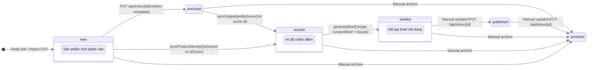

**Trigger files:**
- `lib/inbox/process-inbox-item.ts` → tạo `new`
- `lib/services/score-identity.ts` → `new/enriched` → `scored`
- `lib/content/generate-brief.ts` → `scored` → `briefed` (atomic `$transaction` + optimistic lock)
- `app/api/inbox/[id]/route.ts` → manual transitions (validated)

---

## 2. Content Asset (ContentAsset.status)

> Vòng đời của mỗi video asset từ draft đến logged.

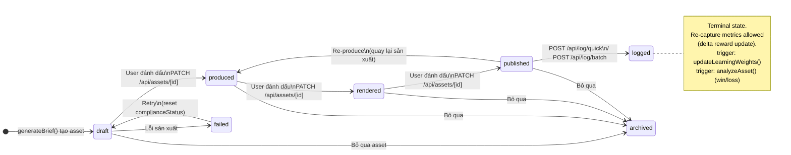

**Retry logic:** Khi `failed → draft`, `complianceStatus` reset về `"unchecked"` và `complianceNotes` xóa.

**Batch auto-completion:** Khi asset thay đổi status, `checkBatchCompletion()` tự kiểm tra nếu tất cả assets trong batch đã terminal → chuyển batch sang `done`/`failed`.

**Slot sync** — khi asset thay đổi status, ContentSlot tự đồng bộ qua `syncSlotStatusFromAsset()`:

| Asset status | → Slot status |
|---|---|
| `draft` | `planned` |
| `produced` | `produced` |
| `rendered` | `rendered` |
| `published` | `published` |
| `archived` | `skipped` |
| `logged` | `published` |
| `failed` | `skipped` |

> TODO v2: Thêm `manualOverride` flag để user skip slot không bị sync ghi đè.

---

## 3. Content Brief (ContentBrief.status)

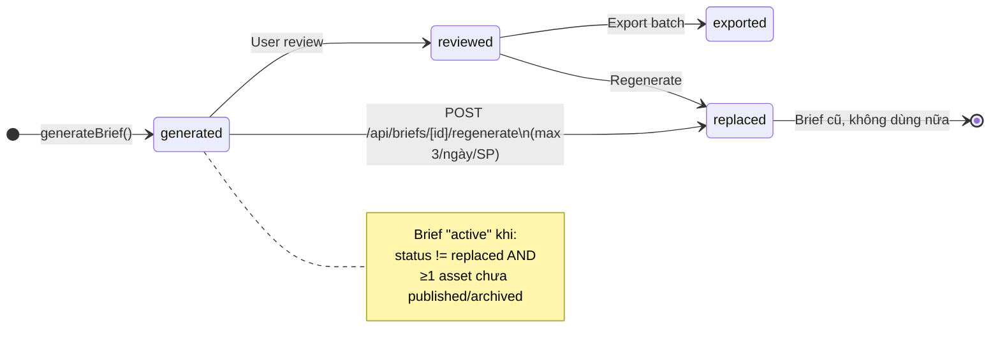

**Race condition protection:** `generateBrief()` tách AI call (bên ngoài) khỏi DB writes (atomic `$transaction`). Optimistic lock qua `updateMany` WHERE clause ngăn 2 brief tạo cùng lúc.

**Orphan cleanup:** Khi brief bị `replaced`, tất cả assets ở `draft` của brief cũ tự archive (atomic transaction).

---

## 4. Content Slot (ContentSlot.status)

> Lịch sản xuất nội dung theo kênh.

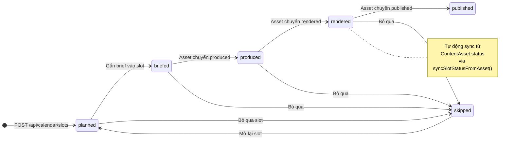

---

## 5. Data Import (DataImport.status)

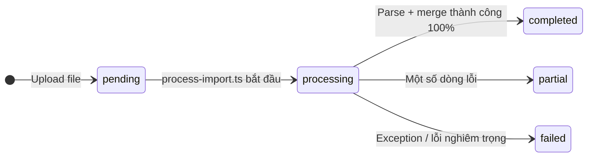

**Partial clarification:** Khi `partial`, các dòng thành công ĐÃ được commit. Chỉ dòng lỗi bị skip.

---

## 6. Campaign (Campaign.status)

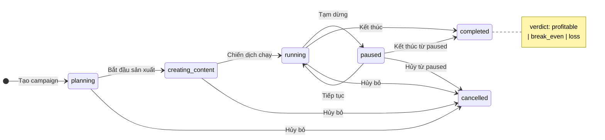

---

## 7. Commission (Commission.status)

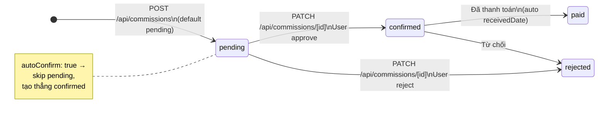

---

## 8. Production Batch (ProductionBatch.status)

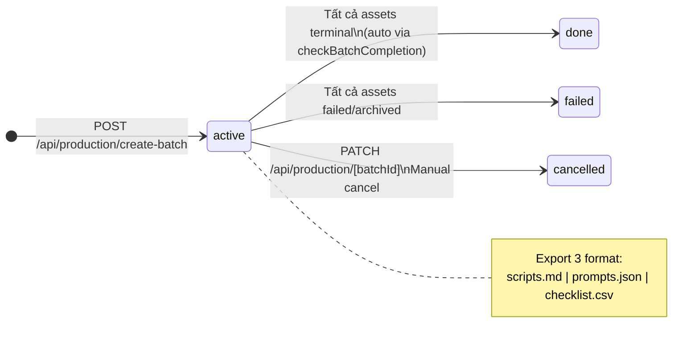

**Auto-completion:** `checkBatchCompletion()` chạy sau mỗi asset status change. Nếu tất cả assets đã terminal:
- Tất cả `failed`/`archived` → batch `failed`
- Có ít nhất 1 non-failed → batch `done`

---

## 9. TikTok Channel (TikTokChannel.isActive)

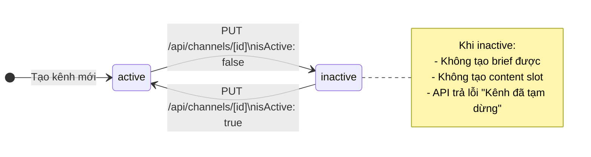

---

## 10. InboxItem (InboxItem.status) — One-shot Classification

> Kết quả phân loại khi paste link. Có retry cho failed items.

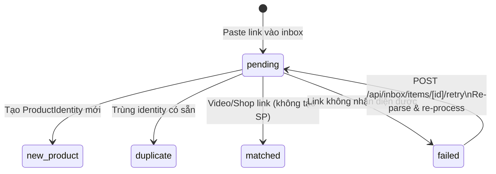

---

## 11. Learning Loop — Continuous Flow (không phải discrete states)

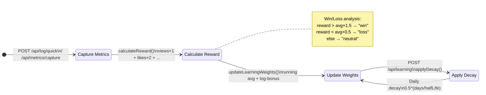

**Per-channel weights:** `LearningWeightP4` giờ có `channelId`. Dual-write: mỗi metric update ghi cả channel-specific (`channelId: "chn_xxx"`) VÀ global (`channelId: ""`). Query dùng `channelId: { in: [channelId, ""] }` rồi dedupe (channel wins over global).

**Re-capture:** Asset đã `logged` vẫn nhận thêm `AssetMetric`. Learning weights update bằng delta reward (`newReward - previousReward`), chỉ khi `|delta| > 0.01`.

---

## 12. Product Lifecycle (ProductIdentity.lifecycleStage) — Computed

> Không phải state machine — tính toán từ snapshot data.

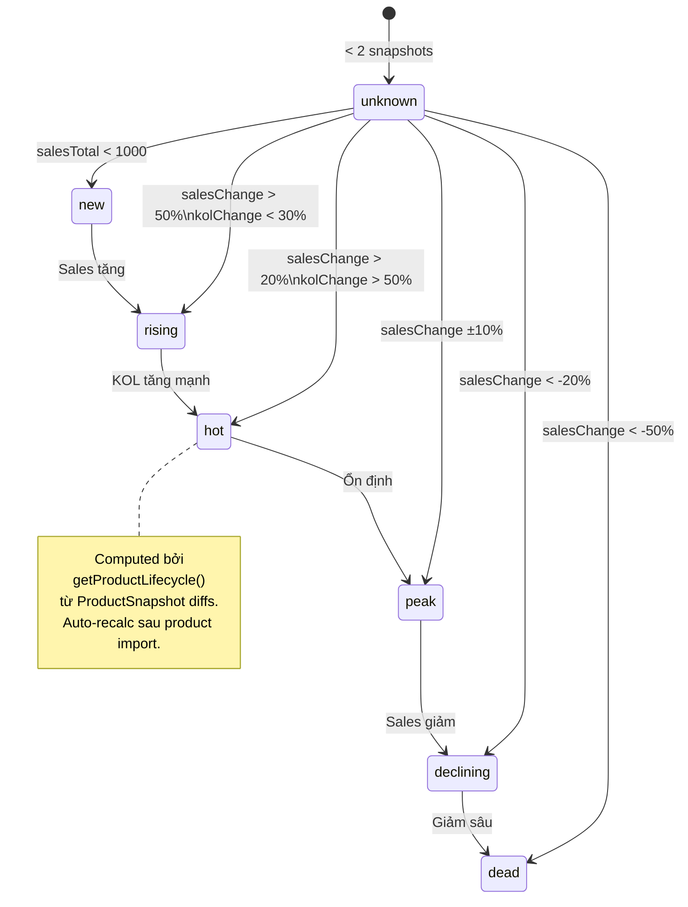

**Auto-refresh:** Lifecycle tự recalculate sau khi scoring hoàn tất trong product import (`app/api/upload/products/route.ts`).

---

## 13. DeltaType (ProductIdentity.deltaType) — Classification

> Phân loại mỗi lần import mới.

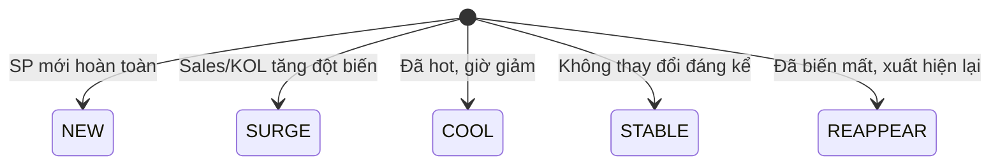

---

## Compliance Status (ContentAsset.complianceStatus) — One-shot

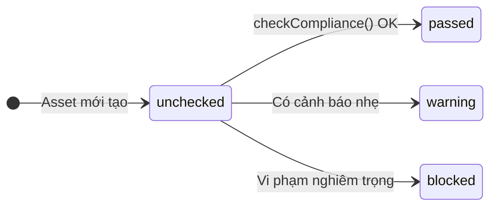

**Reset:** Khi asset `failed → draft` (retry), `complianceStatus` reset về `unchecked`.

---

## Tổng quan — Luồng chính End-to-End

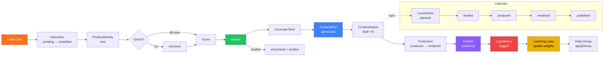

---

## Tham chiếu nhanh

| Model | Field | States | Loại |
|---|---|---|---|
| ProductIdentity | `inboxState` | new → enriched → scored → briefed → published → archived | Progression |
| ContentAsset | `status` | draft → produced → rendered → published → logged; failed ↔ draft; published → produced | Progression |
| ContentAsset | `complianceStatus` | unchecked → passed / warning / blocked (reset on retry) | One-shot |
| ContentBrief | `status` | generated → reviewed → exported / replaced | Progression |
| ContentSlot | `status` | planned → briefed → produced → rendered → published / skipped; skipped → planned | Synced from Asset |
| DataImport | `status` | pending → processing → completed / partial / failed | Progression |
| Campaign | `status` | planning → creating_content → running ↔ paused → completed / cancelled | Progression |
| Commission | `status` | pending → confirmed → paid / rejected | Progression |
| ProductionBatch | `status` | active → done / failed / cancelled | Auto-completion |
| TikTokChannel | `isActive` | true / false | Boolean toggle |
| InboxItem | `status` | pending → new_product / duplicate / matched / failed; failed → pending | One-shot + retry |
| ProductIdentity | `lifecycleStage` | new / rising / hot / peak / declining / dead / unknown | Computed |
| ProductIdentity | `deltaType` | NEW / SURGE / COOL / STABLE / REAPPEAR | Classification |
| LearningWeightP4 | weight/avgReward | Continuous numeric, per-channel + global | Continuous |

---

## Validation Engine

Tất cả state transitions được validate centrally:

```typescript
import { validateTransition, assertTransition } from "@/lib/state-machines/transitions";

// API routes — return 400 on invalid
const check = validateTransition("assetStatus", current, next);
if (!check.valid) return NextResponse.json({ error: check.error }, { status: 400 });

// Service functions — throw on invalid
assertTransition("inboxState", current, next);
```

Source of truth: `lib/state-machines/transitions.ts`
