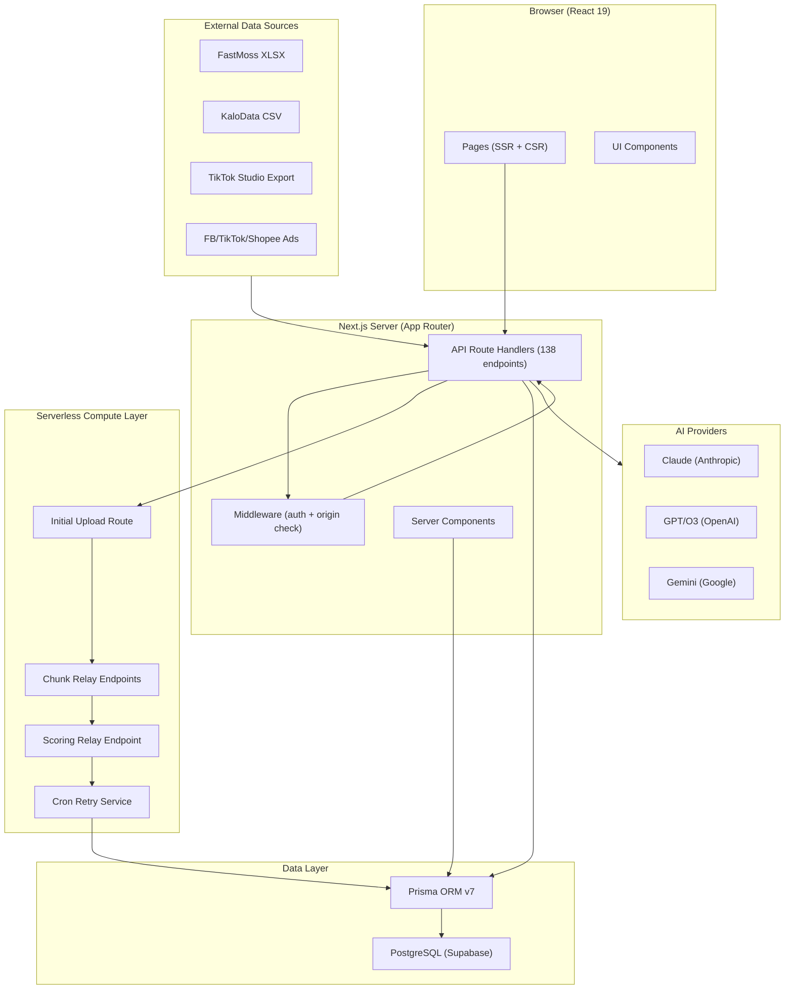

# System Architecture — PASTR

Complete system design documentation for the PASTR affiliate video production platform.

---

## 1. Architecture Overview



---

## 2. Niche Intelligence Module Architecture

### Overview

The Niche Intelligence module guides users through a 4-step wizard to discover profitable niches and auto-create TikTok channels.

**Flow:**
1. **Explore:** User selects from 10+ niche categories
2. **Analyze:** AI analyzes market potential, competition, profit margin
3. **Create:** System auto-creates TikTok channel with Character Bible
4. **Success:** Channel ready, user can start importing products

### 2.1 Niche Finder Wizard

**Pages:** `/niche-finder`

**Components:**
- `NicheExploreStep` — Display 10 niche categories with descriptions
- `NicheAnalyzeStep` — AI analysis results (market potential, competition level, avg margin, recommendations)
- `NicheCreateStep` — Channel creation confirmation, auto-fill channel name
- `NicheSuccessStep` — Success message, link to start importing

**API Endpoints:**
- `POST /api/ai/analyze-niche` — AI analyzes niche market data
- `POST /api/channels/create-from-niche` — Auto-create channel with generated Character Bible
- `GET /api/niche-finder/categories` — List 10 niche categories

### 2.2 Niche Analysis Engine

**Code:** `lib/ai/analyze-niche.ts`

AI performs market analysis on selected niche:
- **Market potential (30%):** Search volume, trend trajectory, market size
- **Competition level (25%):** Number of competitors, market saturation
- **Profit margin (25%):** Typical commission rates, product prices, profit estimates
- **Content difficulty (20%):** Ease of creating compelling videos, asset availability

**Output:** JSON with scores, recommendations, suggested channel name, description

### 2.3 Auto-Channel Creation

**Code:** `lib/content/create-niche-channel.ts`

When user confirms channel creation:
1. **Generate channel profile:** AI creates channel name, description, persona
2. **Generate Character Bible:** AI creates 7-layer character framework for the niche
3. **Create TikTokChannel record:** Store in database with generated profile + Character Bible
4. **Create NicheProfile:** Link channel to original niche selection (for analytics)

**Benefits:** Users don't manually create 50+ fields; AI handles entire setup in 2 minutes

---

## 2.4 Telegram Bot Webhook Integration

**Endpoint:** `POST /api/telegram/webhook` — Receives messages from Telegram bot

**Flow:**
1. User sends Telegram message with product link or question
2. Telegram API forwards to `TELEGRAM_WEBHOOK_URL` (set in settings)
3. Handler validates Telegram signature (HMAC-SHA256)
4. Link extraction: detects product URLs (TikTok Shop, Shopee, etc.)
5. If product link: stores in `CompetitorCapture` for trend analysis
6. Responds to user via Telegram (success/error message)

**Key Components:**
- `lib/agents/telegram-bot-handler.ts` — Message parsing, link extraction, competitor capture
- `app/api/telegram/setup` — Initialize webhook URL on Telegram API
- `app/api/telegram/webhook` — Main handler for incoming messages
- `app/api/settings/telegram-info` — Retrieve bot configuration

**Security:** HMAC signature verification prevents unauthorized requests

---

## 2.5 PWA (Progressive Web App) Support

**Purpose:** Mobile installation without App Store, offline-first capability

**Key Files:**
- `public/manifest.json` — PWA metadata (name, icons, start_url, display: "standalone")
- `public/sw.js` — Service Worker for offline caching
- `app/layout.tsx` → `components/layout/pwa-head.tsx` — PWA head meta tags + install prompt

**Features:**
- Mobile FAB (floating action button) for quick-log function
- Installable on iOS/Android home screen
- Offline support for critical pages (caching strategy)
- Web app icon (192x192, 512x512)
- Splash screen support

**Cron Jobs Integration:** Service Worker doesn't trigger cron; cron runs server-side on 6 schedules

---

## 3. Chunked Import & Relay Architecture

### Overview

The system handles file imports up to 3000+ products by chunking across multiple serverless invocations:

1. **Upload Route** — Receives file, parses, deduplicates (first 300 products)
2. **Import-Chunk Relay** — Processes remaining 300-product chunks
3. **Scoring Relay** — Triggers batch scoring after last import chunk
4. **Cron Retry** — Safety net; retries failed/stuck batches (daily midnight UTC)

### 2.1 Import Phase

**Endpoint:** `POST /api/upload` — Parses file, normalizes, deduplicates, fires initial batch processing.

**Config:** `IMPORT_CHUNK = 300` products/invocation, `PARALLEL = 20` concurrent DB operations.

### 2.2-2.3 Chunked Relay Pipeline

**Flow:**
1. `/api/upload` parses first 300 products, fires `/api/internal/import-chunk` for remainder
2. Each relay processes 300 products (~10-15s), fires next if remaining
3. Final chunk triggers `/api/internal/score-batch`

**Features:**
- Chunks execute in parallel (no waiting)
- Exponential backoff retry (1s → 2s → 4s) with max 3 attempts
- Atomic progress updates (no transactions to avoid PgBouncer conflicts)
- Non-blocking: returns 202 Accepted to client immediately

### 2.4 Retry-Scoring Cron Service

**Endpoint:** `GET /api/cron/retry-scoring` — Daily midnight UTC (`0 0 * * *`)

**Logic:**
- Detects stuck batches using scaled threshold: `BASE (3 min) + (recordCount / 150) * 1 min`
- Retries failed/stuck scoring up to 3 times per batch
- Rate-limited to 5 candidates per run to prevent cascade failures

**Benefits:** Safety net catches missed relays, network transients, DB connection drops

---

## 5. Product Data Flow

### Step 1: Classification

Files (FastMoss XLSX, KaloData CSV, etc.) → Normalized products with fields:
- `name`, `price`, `category`
- `sales7d`, `salesTotal`, `revenue7d`, `revenueTotal`
- `commissionRate`, `totalKOL`, `kolOrderRate`

### Step 2: Deduplication

Normalize URLs (strip params, trailing slash) → detect duplicates within batch

### Step 3: Identity Sync

Match against existing `ProductIdentity` → Create new or link `ProductUrl` variants

### Step 4: Snapshot Creation

Create historical `ProductSnapshot` (for delta classification: NEW/SURGE/COOL/STABLE)

### Step 5: Scoring

Parallel batch scoring (max 30 concurrent):
- **AI Score** — 55% weight (market_demand 35%, quality_trust 25%, viral_potential 25%, risk 15%)
- **Base Formula Score** — 45% weight (commission 25%, trending 25%, competition 20%, price appeal 15%, sales velocity 15%)

### Step 6: Learning Update

If >= 30 feedbacks exist → Apply personalized weight adjustments

---

## 6. Database Schema

**Key Tables for Import:**

| Table | Columns | Purpose |
|-------|---------|---------|
| `ImportBatch` | id, batchId, fileName, format, status, totalRows, processedRows, recordCount, scoringStatus, completedAt, errorLog | Track import session |
| `ProductIdentity` | id, combinedScore, lifecycleStage, deltaType, inboxState | Canonical product entity |
| `ProductUrl` | id, productId, url, urlType (tiktok_shop/fastmoss/kalodata/video/shop) | URL variants |
| `ProductSnapshot` | id, productId, importBatchId, price, salesTotal, ..., createdAt | Historical snapshots for delta |
| `DataImport` | id, batchId, source, rawData (JSON), createdAt | Generic import record |

**Key Relationships:**
- `ImportBatch` 1:N `ProductSnapshot`, `DataImport`
- `ProductIdentity` 1:N `ProductUrl`, `ProductSnapshot`
- `ImportBatch.id` → linked products via `ProductSnapshot.importBatchId`

**Data Integrity & Cascading Rules:**

Database enforces referential integrity with cascade/setNull rules on 10 critical relations:

| Relation | On Delete | Purpose |
|----------|-----------|---------|
| `Feedback` → `Product` | Cascade | Remove feedback when product deleted |
| `ProductSnapshot` → `Product` | Cascade | Remove snapshots when product identity removed |
| `ProductSnapshot` → `ImportBatch` | Cascade | Cleanup snapshots when batch deleted |
| `ContentBrief` → `ProductIdentity` | Cascade | Remove briefs when product deleted |
| `ContentBrief` → `TikTokChannel` | SetNull | Preserve brief when channel deleted |
| `ContentAsset` → `ProductIdentity` | Cascade | Remove assets when product deleted |
| `ContentAsset` → `ContentBrief` | SetNull | Preserve asset when brief deleted |
| `ContentSlot` → `ProductIdentity` | SetNull | Preserve slot when product deleted |
| `ContentSlot` → `ContentAsset` | SetNull | Preserve slot when asset deleted |
| `NicheProfile` → `TikTokChannel` | SetNull | Preserve profile when channel deleted |

This design prevents orphaned records while preserving production assets when source products are cleaned up.

---

## 7. Widget Error Boundaries & Dashboard Resilience

8 key dashboard widgets wrapped in React ErrorBoundary components prevent single widget crashes from affecting entire dashboard. Each shows graceful fallback UI ("Widget unavailable. Retry").

---

## 8. Idempotency & Race Condition Prevention

**ProductIdentity Upsert:** Uses `prisma.upsert()` to prevent duplicates on concurrent paste events. Idempotent: safe to retry without duplicates.

---

## 9. Error Handling & Resilience

### Dashboard Widget Error Boundaries

**8 Widgets wrapped in ErrorBoundary:** Morning Brief, Inbox Stats, Quick Paste, Chart widgets, Metric cards, Skill indicator, Pattern analysis, Calendar.

**Benefits:** Isolated failures prevent cascading crashes. Users continue with other features while one widget recovers.

### Relay Chain Failures

**Scenario 1: Import-chunk relay fails after 3 retries**
- Error logged in `ImportBatch.errorLog`
- Status remains `processing` or becomes `partial`
- Cron job detects stuck batch after BASE_STUCK_MS + (chunks × PER_CHUNK_STUCK_MS)
- Cron retries scoring (up to 3 times)

**Scenario 2: Scoring relay fails**
- `scoringStatus` = `failed`
- Cron immediately detects and retries
- Max 3 scoring retries per batch

**Scenario 3: UI detects import stuck (polling)**
- Client shows "Retry" button
- User clicks → calls `POST /api/internal/score-batch`
- Manually triggers scoring (alternative to waiting for cron)

### Data Integrity

- **Partial imports allowed** — If import chunk fails, previously imported chunks remain
- **Atomic progress updates** — No transaction locking; each update is independent
- **Snapshot isolation** — Each `ProductSnapshot` linked to `ImportBatch` for auditing
- **Idempotent upserts** — Re-running import chunk safe (duplicate products deduplicated)

---

## 10. Performance Tuning

### Database Optimization

| Optimization | Detail |
|--------------|--------|
| **Parallel queries** | 20 concurrent operations per chunk |
| **No transactions** | Avoid PgBouncer conflicts on Supabase |
| **Pooled connection** | pgBouncer on port 6543 for app traffic |
| **Direct connection** | Port 5432 for Prisma migrations only |
| **Index on URL** | Fast deduplication lookups |
| **Index on importBatchId** | Fast batch filtering |

### Serverless Constraints

| Constraint | Handling |
|-----------|----------|
| **60s maxDuration** | Process 300 products/chunk; ~10-15s per chunk |
| **Memory limit** | Avoid loading entire file into memory; stream parse |
| **CPU throttle** | Parallel queries (not sequential) to maximize throughput |

### Cron Job Configuration

**Vercel cron jobs (6 total) defined in `vercel.json`:**

| Endpoint | Schedule | Purpose | Timezone |
|----------|----------|---------|----------|
| `/api/cron/retry-scoring` | `0 0 * * *` | Midnight UTC | Detect & retry failed/stuck batches |
| `/api/cron/decay` | `0 1 * * *` | 1 AM UTC | Apply decay to learning weights (half-life: 14 days) |
| `/api/cron/nightly-learning` | `0 22 * * *` | 10 PM UTC | Aggregate weekly feedback, update ChannelMemory |
| `/api/cron/weekly-report` | `0 6 * * 0` | 6 AM Sunday UTC | Generate weekly analytics report |
| `/api/cron/morning-brief` | `0 23 * * *` | 11 PM UTC | Generate morning brief for next day |
| `/api/cron/trend-analysis` | `30 22 * * *` | 10:30 PM UTC | Analyze competitor captures, generate insights |

**Note:** 7 cron endpoints exist in `app/api/cron/` (including `weekly-learning` not in vercel.json). Netlify requires external scheduler (EasyCron or GitHub Actions) — see `docs/deployment-guide.md` for setup.

### Timeouts & Backoff

| Metric | Value | Rationale |
|--------|-------|-----------|
| Relay backoff | 1s, 2s, 4s | Exponential; avoids thundering herd |
| Stuck threshold base | 3 min | Allows for normal processing + clock skew |
| Stuck threshold per chunk | +1 min per 150 products | Scales with batch size |
| Cron interval | Daily midnight UTC | Batch retry at off-peak hours |
| Cron candidates | Max 5 per run | Prevents cascade failures |

---

## 11. Monitoring & Logging

### Key Metrics

- **Import batch status:** `processing` → `completed` / `partial` / `failed`
- **Scoring status:** `pending` → `processing` → `succeeded` / `failed`
- **Relay attempts:** Logged with attempt number and backoff duration
- **Error logs:** JSON object in `ImportBatch.errorLog` (fatal, parsing errors, retry counts)

### Client-Side Polling

**Upload Progress Page:**
```typescript
// Poll every 500ms during import
const { status, processedRows, totalRows } = await fetchImportStatus(batchId);
if (status === "completed") showSuccess();
if (status === "failed") showRetryButton();
```

### Server-Side Logging

- `console.error()` on fatal relay failures (checked by monitoring)
- `console.warn()` on non-500 HTTP responses (indicates client error)
- `ImportBatch.errorLog` persists structured error details

---

## 12. API Endpoints (Import & Scoring)

| Endpoint | Method | Responsibility |
|----------|--------|-----------------|
| `/api/upload` | POST | Parse file, normalize, deduplicate, fire initial batch |
| `/api/internal/import-chunk` | POST | Process 300-product chunk, fire next relay |
| `/api/internal/score-batch` | POST | Score all products in batch |
| `/api/cron/retry-scoring` | GET | Detect & retry failed/stuck batches (daily midnight UTC) |
| `/api/imports/[id]/status` | GET | Poll import progress |

---

## 13. Deployment Configuration

**Vercel Config** (`vercel.json`) — 6 cron jobs scheduled (see Section 10 for full table).

**Netlify Config** (`netlify.toml`) — Primary deployment:
```toml
[build]
  command = "pnpm build"
  publish = ".next"

[[plugins]]
  package = "@netlify/plugin-nextjs"
```

**Note:** Netlify does NOT support native cron. Use EasyCron or GitHub Actions to trigger cron endpoints. See `docs/deployment-guide.md` for setup.

**Environment Variables:** See `docs/deployment-guide.md` for canonical list.

**Build Command:** `pnpm build`
**Dev Command:** `pnpm dev`

---

## 14. Key Design Decisions

| Decision | Rationale |
|----------|-----------|
| **Chunked import** | Supports unlimited file sizes (3000+ products) without timeout |
| **Fire-and-forget relay** | Non-blocking; instant response to user; cron safety net |
| **No $transaction** | Avoid PgBouncer deadlocks; parallel atomic updates instead |
| **Parallel queries** | Maximize throughput within 60s serverless limit |
| **Cron fallback** | Handles missed relays, network transients, DB connection drops |
| **Scaled stuck detection** | Account for batch size; larger batches naturally take longer |
| **Progress polling** | Client-driven; avoids server-sent events complexity |

---

## 15. AI Agent System Architecture (Phases 1-6)

### Overview

6-phase intelligent agent system for continuous learning, content optimization, competitor analysis, and win prediction. Runs asynchronously with zero UI overhead.

**Key Design:** $0 AI cost where possible (pure DB queries + formula-based scoring), strategic AI calls for learning + analysis only.

### Phase 1: Schema + Nightly Learning

**New Models:**
- `ChannelMemory` — Stores successful patterns, character traits, format preferences per channel
- `CompetitorCapture` — Logs competitor TikTok videos for trend analysis
- `TelegramChat` — Telegram bot conversation threads

**Extended Models:**
- `ContentAsset` — Added `actual_format`, `actual_style`, `actual_trend`, `actual_engagement` fields
- `UserPattern` — Added `channelId` for channel-scoped learning

**Cron Job:** `/api/cron/nightly-learning` (22:00 UTC daily)
- Aggregates recent feedback by channel
- Updates `ChannelMemory` with winning patterns
- Triggers Phase 2 (brief personalization)

**Code:** `lib/agents/nightly-learning.ts`

### Phase 2: Brief Personalization ($0 AI Cost)

**Module:** `lib/agents/brief-personalization.ts`

Auto-injects `ChannelMemory` context into brief prompts:
```typescript
// Pure DB query: 0 cost
const memory = await prisma.channelMemory.findUnique({
  where: { channelId },
});

// Enrich prompt with memory (character traits, winning formats, etc.)
const enrichedPrompt = `
  Channel memory: ${memory.successPatterns}
  Winning formats: ${memory.successFormats}
  Character tone: ${memory.characterDescription}
  [Original prompt]
`;

// Single AI call with richer context
const brief = await generateBrief(enrichedPrompt);
```

**Benefits:**
- $0 extra cost (memory already stored)
- Briefs auto-adapt to channel history
- No manual prompt tuning needed

### Phase 3: Content Analyzer

**Modules:** `lib/agents/content-analyzer.ts`, `lib/agents/tiktok-oembed.ts`

Triggered when asset posted on TikTok:
1. Extract metadata via TikTok oembed API
2. AI classifies format, style, engagement pattern
3. Update `ContentAsset.actual_*` fields
4. Feed data into learning loop

**Code Flow:**
```typescript
// /api/log/quick → asset updated → analyzer triggered
const video = await getTikTokOembed(videoUrl);
const analysis = await classifyVideo(video);

// Atomic update
await prisma.contentAsset.update({
  where: { id: assetId },
  data: {
    actual_format: analysis.format,
    actual_style: analysis.style,
    actual_engagement: analysis.engagementScore,
  },
});
```

**Cost:** 1 AI call per posted video (on-demand)

### Phase 4: Telegram Bot + Trend Intelligence

**Modules:** `lib/agents/telegram-bot-handler.ts`, `lib/agents/trend-intelligence.ts`

**Setup Routes:**
- `POST /api/telegram/setup` — Initialize Telegram webhook
- `POST /api/telegram/webhook` — Receive messages from bot

**Workflow:**
1. User sends TikTok video link in Telegram
2. Bot extracts metadata + AI analysis
3. Save to `CompetitorCapture`
4. Nightly trend analysis (22:30 UTC) batch-analyzes captured videos
5. Update `TelegramChat` with insights

**Cron Job:** `/api/cron/trend-analysis` (22:30 UTC daily)
```typescript
// Batch analyze all competitor captures from past 24h
const captures = await prisma.competitorCapture.findMany({
  where: { capturedAt: { gte: yesterday } },
});

// Batch AI call: analyze trends
const trends = await analyzeCompetitorTrends(captures);
await prisma.trendReport.create({
  data: { insights: trends, generatedAt: now },
});
```

**Cost:** 2 AI calls/day (nightly trend batch)

### Phase 5: Win Predictor

**Module:** `lib/agents/win-predictor.ts`

Route: `POST /api/agents/predict-win`

**Formula-Based (No AI Cost):**
```typescript
// 6-feature win probability score
const winScore = (
  0.2 * engagementRate +
  0.2 * formatMatchChannel +
  0.15 * trendAlignment +
  0.15 * contentConsistency +
  0.15 * audienceMatch +
  0.15 * seasonalityBoost
) * 100; // 0-100 scale
```

**Input:** ContentAsset, ChannelMemory, TrendReport
**Output:** Win probability %, 6-dimension breakdown
**Cost:** $0 (pure DB + formula)

### Phase 6: PWA + Mobile Quick-Log

**Files:**
- `public/manifest.json` — PWA manifest
- `public/sw.js` — Service worker for offline
- `components/layout/mobile-fab.tsx` — Quick-log FAB button
- `components/layout/pwa-head.tsx` — PWA meta tags

**Features:**
- Installable on mobile home screen
- Offline support (service worker caches key routes)
- Quick-log FAB floats on inbox/dashboard
- One-click video log from homescreen

### Data Flow Diagram

```
┌─────────────────────────────────────────────────────────┐
│ Content Workflow                                        │
└─────────────────────────────────────────────────────────┘

User Creates Brief
       ↓
  Phase 2: Personalization
  (Inject ChannelMemory)
       ↓
   Brief Generated
       ↓
   User Posts Video
       ↓
  Phase 3: Content Analyzer
  (Extract actual_ fields via oembed)
       ↓
   Feedback Recorded
       ↓
  Phase 1: Nightly Learning (22:00 UTC)
  (Update ChannelMemory, track patterns)
       ↓
  Phase 4: Trend Analysis (22:30 UTC)
  (Analyze competitor captures, generate trends)
       ↓
  Phase 5: Win Prediction
  (Score future content via formula)
       ↓
  Next Brief Creation (loop to Phase 2)

┌─────────────────────────────────────────────────────────┐
│ Telegram Integration (Async)                            │
└─────────────────────────────────────────────────────────┘

User sends TikTok link in Telegram
       ↓
  Phase 4: Bot Handler
  (Extract metadata, save CompetitorCapture)
       ↓
  Nightly Trend Analysis (22:30 UTC)
  (Batch AI analysis of all captures)
       ↓
  Insights → Morning Brief recommendations
```

### Cron Schedule

| Cron Job | Schedule | Module | Purpose |
|----------|----------|--------|---------|
| Nightly Learning | 22:00 UTC daily | `nightly-learning.ts` | Aggregate feedback, update ChannelMemory |
| Trend Analysis | 22:30 UTC daily | `trend-intelligence.ts` | Analyze competitor captures, generate insights |
| Retry Scoring | Daily midnight UTC | existing | Safety net for failed imports |

### Cost Analysis (Monthly)

| Phase | AI Calls/Day | Cost/Month | Strategy |
|-------|-------------|-----------|----------|
| 1 (Nightly) | 1 batch | ~$0.10 | Aggregate only |
| 2 (Personalization) | Same as briefs | ~$5 (included) | Enrichment only |
| 3 (Analyzer) | Per video posted | Variable | On-demand classification |
| 4 (Trends) | 1 batch | ~$0.10 | Nightly batch analysis |
| 5 (Win Predictor) | 0 | $0 | Formula-based only |
| 6 (PWA) | 0 | $0 | No AI overhead |
| **Total** | **~3-5 AI calls/day** | **~$5-10/month** | **Optimized for cost** |

---

## 16. Advisory Agent System — Company Hierarchy Model

**Pipeline:** ANALYST (data) → [CMO, CFO, CTO parallel] → CEO (decision)

**Code:** `lib/advisor/analyze-pipeline.ts` (orchestration), `lib/advisor/gather-advisor-data.ts` (data), `lib/advisor/c-level-roles.ts` (role definitions)

**ANALYST** — 8 parallel DB queries via `Promise.all()`: top 10 products by combinedScore, 5 winning patterns (sampleSize≥2), 3 losing patterns, 5 channel memories, + 4 aggregate counts (total/scored/briefed/published).

**C-Level Analysis** — CMO (marketing), CFO (financial), CTO (execution) run in parallel. Each receives ANALYST briefing + user question.

**CEO** — Synthesizes non-error C-level responses into 1 decision with action steps. If a role failed, CEO gets note listing which roles failed.

**Token Limits:** C-levels: 1024 each. CEO: 1200. `ceoBriefReview()`: 512 (lightweight, skips ANALYST + C-levels).

**API:** `POST /api/advisor/analyze` (full pipeline), `POST /api/advisor/followup` (same pipeline). Request: `{ question, context? }`. Response: `{ ceoDecision, cLevelResponses[], analystBriefing, question, timestamp }`.

**Error Handling:** ANALYST fail → empty briefing fallback. 1 C-level fail → CEO synthesizes remaining + failure note. CEO fail → return last state. No retries; user can resubmit.

---

## 17. Scoring System — Detailed Architecture

### 17.1 3-Layer Scoring Pipeline

```
Layer 1: Base Formula Score (no AI, pure data) → 0-100
Layer 2: AI Expert Score (rubric-anchored, 4 criteria) → 0-100
Layer 3: Combined = aiScore × 0.55 + baseFormula × 0.45 → Z-score sigmoid normalize → 0-100
```

**Code:** `lib/services/score-identity.ts` — orchestrates all 3 layers.

**Fallback logic:** If AI unavailable → use base formula only. If neither → use Content Potential Score as last resort.

### 17.2 Base Formula Score (5 Components)

**Code:** `lib/scoring/formula.ts`

| Component | Weight | Range | Key Logic |
|-----------|--------|-------|-----------|
| Commission | 25% | 0-100 | Piecewise linear: 0-3% → 0-21, 3-7% → 21-53, 7-12% → 53-88, 12-20% → 88-100. VND bonus: 20K-100K/sale = +5 |
| Trending | 25% | 0-100 | Priority 1: salesGrowth7d tiers (-30% → 0, +200% → 100, >500% → 75 spike flag). Priority 2: sales7d/salesTotal ratio |
| Competition | 20% | 0-100 | KOL count (≤3 = 100, >100 = 10) - video saturation penalty (>1000 = -20) + kolOrderRate bonus (>60% = +15) |
| Price Appeal | 15% | 0-100 | VN TikTok sweet spot: 80K-200K VND = 100. Below 30K or above 1.5M VND = 15-20 |
| Sales Velocity | 15% | 0-100 | 7-day absolute volume: ≥10K = 100, 0 = 5 |

**Formula:** `total = MIN(100, ROUND(commission×0.25 + trending×0.25 + competition×0.20 + price×0.15 + velocity×0.15))`

### 17.3 AI Expert Score (4 Rubric Criteria)

**Code:** `lib/ai/scoring.ts`, `lib/ai/prompts.ts`

| Criterion | Weight | Tiers | Description |
|-----------|--------|-------|-------------|
| Market Demand | 35% | {20,40,60,80,100} | Trending, search volume, pain point severity |
| Quality & Trust | 25% | {20,40,60,80,100} | Brand trust, reviews, certifications |
| Viral Potential | 25% | {20,40,60,80,100} | Visual wow, demo-ability, emotional trigger |
| Risk | 15% | {20,40,60,80,100} | Medical claims, return rate, sensitivity |

**Batch processing:** 30 products per Claude call, 3 concurrent batches, 20 parallel DB writes.

**Validation:** Scores snap to nearest valid tier {20,40,60,80,100}. Batch mean checked against 40-70 range (warns if outside).

**Calibration anchors** (in prompt): Rice cooker = 85, Phone case = 55, Diet pills = 25.

### 17.4 Content Potential Score (6 Dimensions)

**Code:** `lib/scoring/content-potential.ts`

| Dimension | Max Points | Logic |
|-----------|-----------|-------|
| 3-Second Wow Factor | 20 | Has image +8, price tiers (+2 to +12) |
| Content Angle Count | 20 | Category → angle count (4-7), score = MIN(20, angles×3) |
| AI-Friendly Creation | 20 | Category lookup (6-16 points per category) |
| UGC Availability | 20 | KOL count tiers (0-18) + totalVideos/100 bonus |
| Commission Motivation | 10 | Commission rate tiers (1-10 points) |
| Risk Penalty | 10 | Starts at 10, -3 per health/medical keyword match |

**Normalization:** `(score / maxScore) × 100`, clamped 0-100.

### 17.5 Normalization & Known Issues

**Global Z-Score** (`lib/scoring/global-stats.ts`): Welford's algorithm → sigmoid `1/(1+exp(-z))` where `z=(raw-mean)/stddev`. Score 50 = average. 80+ = top 10%. Cold start (<10 products): raw clamp.

**Known Issues (Phase 14 Baseline):**

- **Content potential score lacks discriminative power** — category-based lookup produces similar scores for different products in same category
- **aiScore=0 still produces combinedScore** — falls back to base formula only (no AI component)
- **Virtual/duplicate products** — products without real sales data can score high on price appeal + low competition
- **Spike risk flag** — >500% growth scores 75 instead of 100, but no further penalty
- **Personalization threshold lowered** — from 30 to 5 feedbacks for BASIC tier; may be too aggressive

---

## 18. Learning Engine — Data Flow & Architecture

**Reward formula** (`lib/learning/reward-score.ts`): `log(1+views)×1.0 + shares×0.5 + saves×0.3 + log(1+likes)×0.3 + comments×0.2 + completionRate×5 + orders×10 + log(1+commission/1000)×2`. Orders (×10) strongest signal; views/likes log-scaled.

**LearningWeightP4** — 5 scopes: `hook_type`, `format`, `angle`, `category`, `price_range`. Weight = `avgReward × log(1+sampleCount)` (quality × quantity). Dual writes: channel-specific + global (`channelId=""`).

**Decay** (`lib/learning/decay.ts`): `weight *= 0.5^(days/14)`. Half-life 14 days. Skip if <24h since last update.

**Explore/Exploit** (`lib/learning/explore-exploit.ts`): Hooks: 7 exploit (top weight) + 3 explore (sampleCount<3). Formats: 2 exploit + 1 explore.

**Personalization Tiers** (`lib/scoring/personalize.ts`):

| Tier | Feedbacks | Formula |
|------|-----------|---------|
| None | <5 | No adjustment |
| BASIC | 5-14 | `base×0.9 + categoryBonus×0.1` |
| STANDARD | 15-29 | `base×0.8 + catBonus×0.1 + priceBonus×0.1` |
| FULL | 30+ | `base×0.5 + historicalMatch×0.3 + contentType×0.1 + audience×0.1` |

**Nightly cycle** (`/api/cron/nightly-learning`, 22:00 UTC): Process 10 channels → regenerate patterns → build ChannelMemory (winning/losing combos, used angles/hooks, AI insight if ≥3 videos) → regenerate global patterns.

**Win/Loss** (`lib/learning/win-loss-analysis.ts`): Win = reward > avg×1.5. Loss = reward < avg×0.5. Pattern detection: group by (hook, format, category); winRate ≥50% with ≥2 samples → winning pattern.

---

## 19. Future Improvements

- **Webhook callbacks** instead of polling (requires client-side event listener)
- **Server-sent events (SSE)** for real-time progress updates
- **Batch prioritization** (user can pause/resume imports)
- **Resumable uploads** (restart from failed chunk)
- **Metrics dashboard** (import success rate, scoring latency, etc.)
- **Multi-language support** for brief generation
- **A/B testing framework** for content variants
